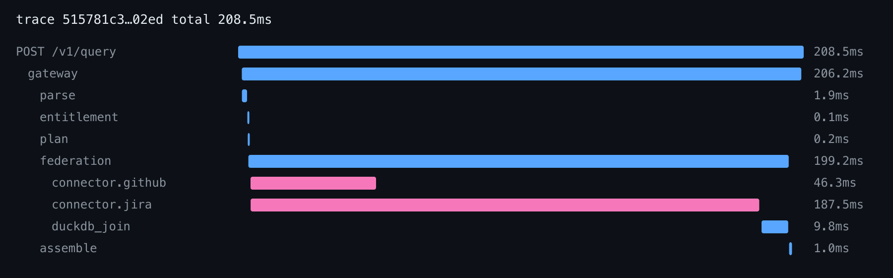

# Universal SQL — federated queries across enterprise apps

One SQL query joining **GitHub pull requests to Jira issues**, served through a single API with
query-time entitlement (RLS/CLS compiled into the plan), per-tenant rate limiting,
staleness-controlled caching, and honest partial-result degradation.

```sql
SELECT pr.title, pr.author, issue.key, issue.status
FROM   github.pull_requests pr
JOIN   jira.issues issue ON pr.issue_key = issue.key
WHERE  pr.repo = 'ema/core' AND pr.state = 'open' AND issue.status = 'In Progress'
ORDER BY issue.updated DESC
LIMIT 50;
```

> **What this repo is.** Take-home deliverables **3 (the runnable prototype)** and **4 (this
> README)**. Deliverables 1 and 2 — the design doc with diagrams, and the six-month execution plan —
> are the **Google Doc**.

---

## What's built

| Requirement | How |
|---|---|
| `POST /v1/query` returning rows, columns, `freshness_ms`, `rate_limit_status`, `trace_id` | one endpoint, one typed envelope |
| A policy config with one RLS rule and one column mask | [`config/policies.yaml`](config/policies.yaml) — 3 policies: an RLS rule, a CLS mask, an explicit deny |
| Two connectors | GitHub + Jira, mocked behind one adapter contract |
| Entitlements: token → scopes/roles → RLS/CLS | four gates — identity, tenant status, OAuth scope, then RLS/CLS **compiled into the query plan** |
| Rate limits: token bucket with burst, friendly error, async reroute | per `(tenant, connector)` bucket in Redis; `429` carries `Retry-After` and points at `/v1/query/async` |
| Freshness: `max_staleness` knob, cache hit vs live | per-query knob; every response reports `sources[].served` as `live` or `cache` |
| Load test at ~500 QPS for 60s | k6, 20 tenants, 8 workers — holds **400 req/s** inside SLO; see [load results](docs/LOAD-RESULTS.md) |
| Observability: a Prometheus metric and a trace showing connector time | `/metrics` plus a per-source span waterfall |

**Supported SQL:** projection, `WHERE` (`= != < > <= >=`, `AND`, `OR`), `JOIN`, `ORDER BY`, `LIMIT`,
and cursor pagination. Anything else is refused with a message naming the construct.

**The property worth checking:** entitlement is compiled into the plan and **pushed down to the
source**, never applied to rows after fetching. alice sees 3 rows and bob sees 1 from byte-identical
SQL — and the rows bob cannot see were never requested from Jira.

## What's mocked

Two things, stated plainly rather than left for a reader to find:

1. **The connectors.** GitHub and Jira are in-memory datasets behind a real adapter seam — the
   adapter builds the HTTP call it *would* send, and parsing reads it back the way the source would.
   `mock_transport.py` is the one method a live adapter replaces.
2. **The identity provider.** `POST /v1/auth/mock-token` mints a token for any tenant, role and scope
   with no authentication, standing in for per-tenant OIDC. **So the tenant and scope gates here are
   demonstrable, not enforceable** — a caller can mint themselves anything. They are real code on the
   real request path, and production puts a real IdP in front of them. What stays adversarially
   meaningful either way is that row- and column-level entitlement is compiled into the plan.

## Run it

**Needs Docker and `make`.** The examples below pipe through `jq` for readability; drop it if you
don't have it.

```bash
cp .env.example .env
make up      # app + postgres + redis; cold-to-serving in under 60s
make seed    # loads config/*.yaml into the control plane; re-runnable
```

Then run the query as alice:

```bash
T=$(curl -s -X POST localhost:8000/v1/auth/mock-token -H 'content-type: application/json' \
     -d '{"user":"alice","role":"support","tenant":"tenant_acme"}' | jq -r .token)

curl -s -X POST localhost:8000/v1/query -H "Authorization: Bearer $T" \
     -H 'content-type: application/json' \
     -d '{"sql":"SELECT pr.title, pr.author, issue.key, issue.status FROM github.pull_requests pr JOIN jira.issues issue ON pr.issue_key = issue.key WHERE pr.repo = '"'"'ema/core'"'"' AND pr.state = '"'"'open'"'"' AND issue.status = '"'"'In Progress'"'"' ORDER BY issue.updated DESC LIMIT 50","max_staleness_ms":0}' | jq
```

```jsonc
{
  "columns": [ {"name": "title",  "type": "string", "source": "github", "masked": false},
               {"name": "status", "type": "string", "source": "jira",   "masked": false} ],
  "rows": [ ["Fix session expiry on refresh", "ana-dev", "SUP-12", "In Progress"],
            ["Retry webhook delivery",        "ben-dev", "SUP-13", "In Progress"],
            ["Paginate the audit export",     "ana-dev", "SUP-14", "In Progress"] ],
  "freshness_ms": 195,
  "rate_limit_status": { "github": {"remaining": 6, "throttled": false},
                         "jira":   {"remaining": 34, "throttled": false} },
  "sources": [ {"connector": "github", "state": "ok", "served": "live"},
               {"connector": "jira",   "state": "ok", "served": "live"} ],
  "join_status": "complete", "partial": false, "next_cursor": null, "warnings": [],
  "trace_id": "046780b37b180370ebd71c778915be84",
  "stats": { "parse_ms": 18.1, "entitlement_ms": 0.92, "plan_ms": 0.14,
             "connector_ms": {"github": 46.6, "jira": 186.07} }
}
```

**Now swap `alice` for `bob`: three rows become one, from the same SQL.** For `carol`, zero — she is
entitled but has nothing assigned. The rule doing that is the first policy in
[`config/policies.yaml`](config/policies.yaml).

Run `make test` for the unit suite — it needs no containers, so it works while images are still
pulling. `make test-integration` needs `make up` first.

## Try more queries

| Command | What you get |
|---|---|
| `make demo` | the 60-second narrative — alice, bob, the staleness knob, a forced timeout → [`demo-output.txt`](docs/artifacts/demo/demo-output.txt) |
| `make demo-detail` | the coverage matrix — every published capability with the call that reaches it: all six error codes, the three distinct "no rows" shapes, pagination to the last page, the SQL-subset boundary → [`demo-detail.txt`](docs/artifacts/demo/demo-detail.txt) |
| `make connectors` | what goes in and out of a connector — the call built, the response parsed, pagination, the rate-limit refusal |
| `make artifacts` | regenerates all of the above plus the trace and metrics scrape |

## The trace



```
POST /v1/query         │████████████████████████████████████████████████│    208.5ms
  gateway              │▊██████████████████████████████████████████████▊│    206.2ms
    parse              │▌                                               │      1.9ms
    entitlement        │▏                                               │      0.1ms
    plan               │▏                                               │      0.2ms
    federation         │▏█████████████████████████████████████████████▊ │    199.2ms
      connector.github │ ██████████▊                                    │     46.3ms
      connector.jira   │ ███████████████████████████████████████████▎   │    187.5ms
      duckdb_join      │                                            ▋█▋ │      9.8ms
    assemble           │                                              ▎ │      1.0ms
```

**What it proves.** Parse, entitlement, plan and assemble together are **3.2ms of 208ms — about
1.5%**. Everything this prototype is *about* — validating the SQL subset, compiling an RLS predicate
and a CLS mask into the AST, splitting predicates by owning source — is free next to one remote
call, which is the argument for doing entitlement at plan time. The two connector bars **overlap**,
so the request costs `max(46, 188)` rather than the sum; the spans are opened inside the
`asyncio.gather` closure precisely so that is visible. And `duckdb_join` starts only when the slower
source finishes — a federated engine working correctly.

There is no tracing backend: spans go to JSONL and `scripts/waterfall.py` renders them with the
standard library. `make trace` warms the pool and truncates the log first, so the artifact describes
one warm query against the code that is checked out.

## The load test

k6 against 20 tenants, 8 workers, on one laptop, 60s per run.

**It holds 400 req/s cleanly** — everything offered served, nothing dropped, no failed checks, p50
195ms against a 500ms budget and p95 553ms against 1.5s. Tenant isolation held in every run with
**zero foreign rows**, and the measured cache hit ratio came out at 95.1% against an intended 95%.

| Offered | Achieved | p50 | p95 | Dropped |
|---|---|---|---|---|
| 200 | 200.0 | 94.2ms | 472.9ms | 0 |
| 300 | 300.0 | 141.9ms | 523.6ms | 0 |
| **400** | **400.0** | **195.1ms** | **552.9ms** | **0** |
| 500 | 414.9 | 4,289ms | 5,818ms | 5,110 |

**It is a cliff, not a curve.** 400 serves everything; 500 drops 5,110 iterations and p50 jumps 22×.
That shape — plus app CPU peaking at 220% of 1200% available — says the limit is a fixed concurrency
bound, not a resource running out. Under saturation 340 responses came back `partial` with the
affected source named: the system sheds work and says so rather than returning wrong answers.

Method: **[docs/LOAD-TESTING.md](docs/LOAD-TESTING.md)** · Numbers, the diagnosis and what we would
do next: **[docs/LOAD-RESULTS.md](docs/LOAD-RESULTS.md)**

## Where to look

```
src/
├── gateway/         auth, routes, the four entitlement gates
├── sqlparse/        sqlglot parse + the supported-subset whitelist
├── entitlement/     RLS predicate + CLS mask compiled INTO the AST   <- the crux
├── planner/         pushdown split: what the source filters vs what we do
├── execution/       parallel fetch, DuckDB join, envelope assembly
├── connectors/      the adapter contract — build a call, answer it, parse it back
├── governance/      token bucket, freshness cache, per-tenant secrets, audit
├── control_plane/   Postgres reads + TTL cache + migrations
└── observability/   OTel stage spans + Prometheus registry

config/              policies, grants, budgets, and one file per connector — all YAML
scripts/             seed, demo, demo-detail, trace, waterfall renderer
load/                the k6 profiles — no remote imports, so they run offline
docs/artifacts/      every generated artifact
tests/unit/          hermetic, no Docker — what the pre-commit hook runs
tests/integration/   needs `make up`
```

**Onboarding a connector is one YAML file plus one adapter class** — and a second *endpoint* on an
existing connector is a row in `config/connectors/<name>.yaml` with no Python at all.

## How this was built

The design document and six-month execution plan are the Google Doc. What this repository adds is
the **record of how the prototype got built**, because it was built with an AI-assisted workflow and
that process is legible rather than hidden:

| | |
|---|---|
| `docs/kickoff/v*/architecture.md` | the architecture decisions, recorded as they were taken — four rounds, one per phase |
| `docs/kickoff/v*/research-repos.md` | the prior-art and runtime probes each round ran before deciding |
| `docs/phoenix-development-workflow/specs/` | per-phase design specs — scope tiering, file paths, the test list |
| `docs/phoenix-development-workflow/plans/` | per-phase task plans, each with its own verification gate |

Every plan carries the decisions it took and the watch-outs it hit, so a reviewer can follow a
feature from the decision that motivated it, through the spec, to the tasks that built it.

## Repository access

Private repository — access granted by invitation.

```
git clone https://github.com/sid17/ema-universal-sql.git
```
