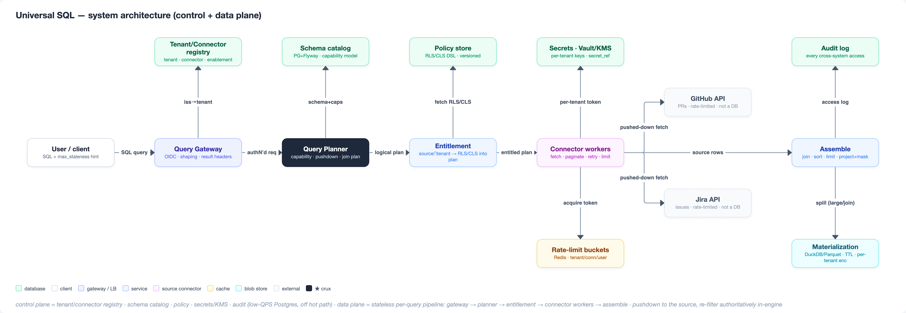
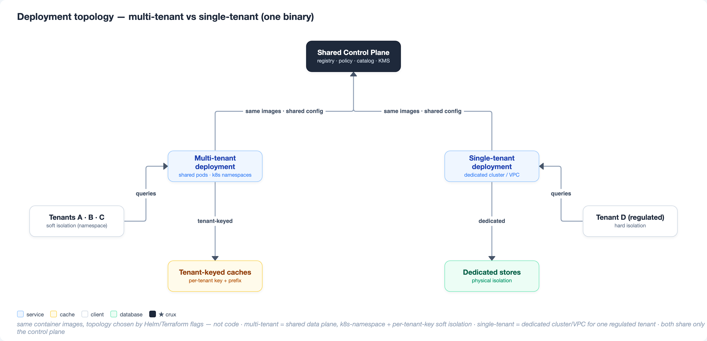
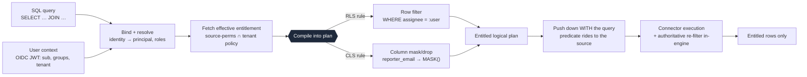
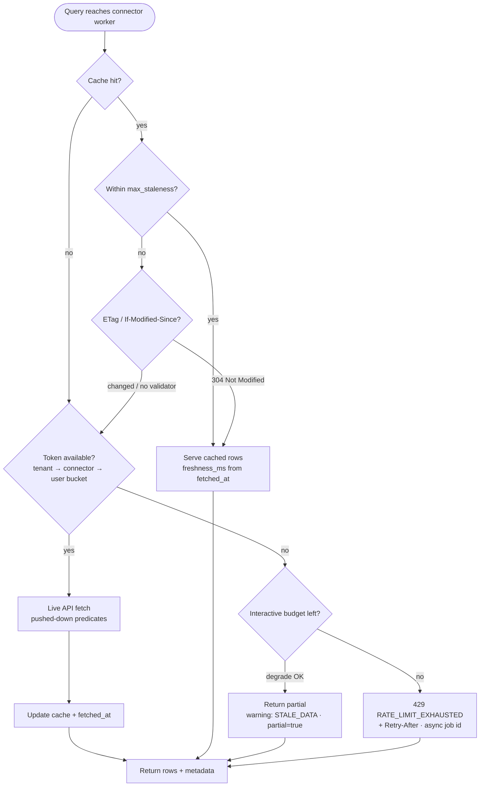
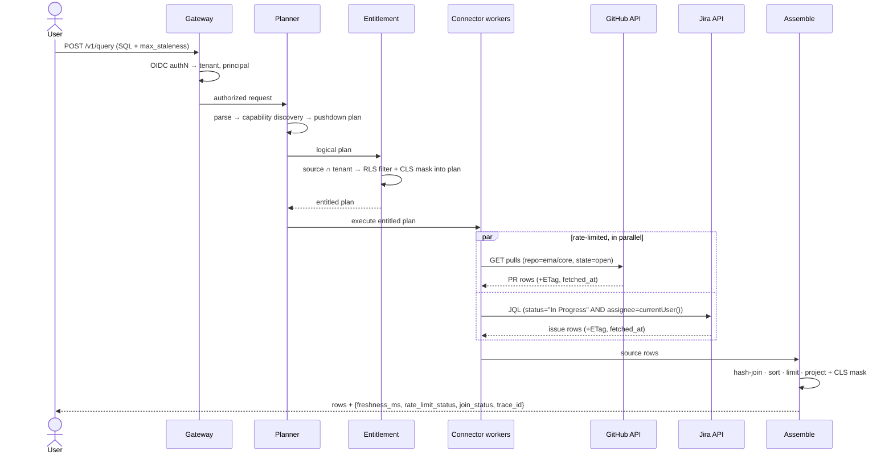

# Universal SQL Across Enterprise Apps — Design Document

> **Scenario:** GitHub (PRs) ↔ Jira (issues). **Author:** Siddhant Manocha.
> **Positioning:** Trino-style federation + Steampipe-style connector plugins, hardened for multi-tenant
> enterprise with query-time entitlement compilation.

**Contents**
1. Executive Summary & Architectural Trade-offs
2. Core System Architecture & Component Design
3. Security, Isolation & Entitlements (RLS / CLS)
4. Rate Limiting, Freshness & Performance Strategy
5. Capacity Planning, Scalability & Operations
6. Prototype Architecture & Scenario Walkthrough
7. Six-Month Execution Plan & Roadmap
8. Appendix

---

## 1. Executive Summary & Architectural Trade-offs

> *Building a Universal SQL Layer over enterprise SaaS APIs isn't just a query-execution problem — it's a rate-limit, security, and schema-translation challenge. We prioritize direct source predicate pushdown over bulk ingestion to guarantee zero-data-retention compliance while staying cost-effective at 1k QPS.*

**1.1 Problem & vision.**
An enterprise runs its work across dozens of SaaS apps — GitHub, Jira, Salesforce, Zendesk, Drive, Notion — each a silo behind its own API, auth model, schema, and rate limits. Answering a question that spans two of them ("which of my open PRs are blocked on an in-progress Jira issue?") means bespoke integration code or a brittle ETL pipeline that goes stale the moment it lands. We build a **Universal SQL layer**: users write ordinary SQL — projection, filters, pagination, joins — and the engine executes it *on demand* against the live source APIs, with no bulk copy, entitlements enforced per user, and every result annotated with how fresh and how complete it is.

Architecturally this is a **federated query engine over SaaS connectors** — Trino-style federation with Steampipe-style connector plugins. Prior art (StackQL, Steampipe) proves SQL-over-APIs works, but only as *single-tenant* desktop/CI tools. Turning it into a multi-tenant enterprise service means owning exactly the hard parts they skip: **query-time RLS/CLS entitlement, per-tenant fairness over rate-limited APIs, credential isolation + crypto-shred, entitlement-aware caching, and connector reliability.** These five hard parts are the spine of this document.

One constraint shapes every decision: **the data lives behind rate-limited, low-capability, permission-bearing APIs we do not own.** We can't index everything (freshness + compliance forbid it), can't assume a source can filter/sort/join (capability varies per connector), and can't burn a tenant's whole API budget on one query. So the design optimizes for a single objective — *do the least possible work at the source, exactly once, within budget, and only what the user is entitled to see.*

**1.2 Core architectural invariants (the 5 non-negotiables).** Every later section is a consequence of one of these:
1. **Pushdown First — as an optimization, never a correctness dependency.** Push the most selective predicates and the minimal column set to the source to cut data moved, latency, and rate-limit spend — but the engine re-applies every predicate authoritatively; a source's partial or absent filtering can never change results. (We fetch `projection ∪ every WHERE/ORDER BY column`, so the in-engine re-filter can never drop a valid row — a guard learned from StackQL.)
2. **Zero-Trust Data Plane.** Query compute is stateless and holds no durable customer data; every inter-service call is mTLS; every request carries a verified tenant + principal end to end.
3. **Transient, Encrypted Materialization Only.** When a join or aggregation must spill, it goes to a short-lived (TTL ≤ N min) store encrypted under the *tenant's own* key — never a shared warehouse, never reused across principals.
4. **Fail-Fast with Actionable Metadata.** When a source is throttled, slow, or stale, we return crisp, typed signals (`RATE_LIMIT_EXHAUSTED` + `Retry-After`, `STALE_DATA`, `partial=true`) — never a hang, never a degraded answer dressed up as complete.
5. **Entitlement by Construction.** RLS/CLS compile *into* the query plan and push down with it; the engine never fetches rows the user can't see and then filters them off. Post-filtering leaks data, wastes rate-limit budget, and breaks pagination — so it is banned by design.

**1.3 Architectural trade-off matrix.** The five decisions that most shape the system, and what we deliberately give up for each:

| Decision | We chose | Over | Because | Cost we accept |
|---|---|---|---|---|
| **Join execution** | On-the-fly federated query (live) | Continuous ingestion (ETL/ELT) into a warehouse | Freshness + zero data-retention; no bulk copies of customer data to secure, age, or offboard | Re-fetch per query; bounded by pushdown + short-lived materialization for the heavy cases |
| **Materialization** | Short-lived, per-tenant-encrypted DuckDB/Parquet spill | Shared OLAP warehouse (Snowflake/ClickHouse) | Crypto-shred offboarding, residency, and zero cross-tenant data bleed | Rebuild cost on cache miss; a bounded TTL staleness window |
| **AuthZ engine** | Embedded policy engine on the plan path | Remote AuthZ microservice, called per row | Sub-ms planning latency; entitlement compiles *into* the plan, no per-row RPC fan-out | Policy-cache freshness to manage; engine + policy deploy coupling |
| **Entitlement timing** | Compile RLS/CLS into the plan + push down | Post-filter rows after fetch | No leak, no wasted tokens/pages, pagination stays correct | Planner complexity (policy → AST transform) |
| **Rate-limit fairness** | Hierarchical token buckets + DRR fair scheduler | Global FIFO / per-tenant hard shards | No noisy-neighbor starvation; work-conserving under load | Scheduler complexity; per-tenant/per-connector accounting state |

_No diagram in §1 (kept intentionally lean — the picture is D1 in §2)._

---

## 2. Core System Architecture & Component Design

> *The platform splits into a multi-tenant **control plane** (registry, policies, schemas, secrets) and a stateless **data plane** (gateway, planner, connector SDK) that scales dynamically — and runs single-tenant or multi-tenant without code changes.*

The whole system is one noun with modifiers: **a federated query engine over rate-limited, permission-bearing SaaS APIs.** That noun forces the top-level cut. Config — tenants, connector definitions, policies, secrets, rate-limit budgets — is low-QPS, strongly consistent, per-tenant-keyed, and changes only when an admin acts. Query execution is high-QPS (1k target), stateless, autoscaled, and must be isolated per tenant. Conflating the two is the classic mistake: you want to scale the query path without redeploying policy, and crypto-shred a tenant's keys without touching the query engine. So we split them — **control plane** (state, off the hot path) and **data plane** (per-request, on the hot path). Figure D1 shows the two planes and the left-to-right query flow.



**2.1 Control plane — state, strongly consistent, off the hot path**

The control plane is the single source of truth the data plane *reads* but never *writes on the query path* (the one exception is the audit sink). It is deliberately low-QPS: the planner caches its reads into the data plane, so a query never blocks on a control-plane round trip. One store, one integrity model.

| Component | Stores | Backing store | Notes |
|---|---|---|---|
| **Tenant & connector registry** | `tenant` rows (status, residency, `kms_key_id`); `tenant_connector` grants (which tenant may reach GitHub / Jira, with which OAuth app) | Postgres + Flyway | The coarse-gate source: "may this tenant touch this connector at all." |
| **Schema catalog** | Per-connector virtual tables + columns + **capability model** (§2.2), derived from each connector's OpenAPI-derived definition; versioned | Postgres + Flyway | Read by the planner to plan pushdown; `DESCRIBE github.pull_requests` resolves here. |
| **Policy store** | Tenant RLS filters and CLS masks in a policy DSL (e.g. `issue.assignee = :user`, `MASK(reporter_email)`) | Postgres + Flyway | Compiled *into the plan* at Hop 3 (§3), never applied post-fetch. |
| **Secrets & keys** | Per-tenant OAuth tokens / API keys **by indirection** (a `secret_ref` pointer, never an inline credential); per-tenant KMS keys | Vault + cloud KMS | Per-tenant keys are what make crypto-shred a key-destroy, not a row scrub (§3). |
| **Rate-limit policy store** | Per-tenant / per-connector / per-user budgets and weights | Postgres (policy) → Redis (live counters) | Policy is config here; the live token buckets live in the data plane (§4). |
| **Audit log** | One append-only row per query per source touched: `{tenant, user, connectors, resources, trace_id, rows_returned, ts}` | Postgres / append-only sink | The only thing the data plane *writes* to the control plane, at Hop 5. |

Why Postgres and not a KV store: the interesting invariant is **relational integrity across `tenant ↔ connector ↔ policy`**, plus transactional admin changes (grant a connector, push a policy) that must be atomic and validated. We trade the horizontal write-scale of a KV store for that integrity — an easy trade, because this plane is low-QPS by construction. **Secrets by indirection** is lifted straight from StackQL: config carries a *reference* to the secret, the worker resolves it at request time. Our delta over StackQL's single process-global `--auth` blob is **per-tenant, per-request credential selection** — the same binary serves many tenants, each reaching its own sources under its own key.

**2.2 Data plane — stateless, autoscaled, per-tenant-isolated**

Three components on the hot path, in query order: Gateway → Planner → Connector workers (built on the Connector SDK). All stateless; all horizontally scalable; none holds durable customer data.

**Query Gateway — the front door.** OIDC authN (who is this user, which tenant), coarse authZ (may this tenant hit `github` and `jira` at all — a single registry lookup, *before* any planning), and **request shaping**: parse the SQL, reject anything outside the supported subset (SELECT / WHERE / JOIN / ORDER BY / LIMIT — no writes, no arbitrary functions), attach a per-request timeout and a `trace_id`. The graded principle here is **fail fast and cheap — never start work the entitlement layer will later reject.** Coarse gating is tenant-level and belongs here; fine-grained row/column entitlement is Hop 3, not the gateway's job. On the way out, the gateway is where the result envelope is stamped with its metadata headers — `trace_id`, `freshness_ms`, `rate_limit_status` — so the caller can reason about staleness and throttling without parsing the body. The availability SLO (99.9%) lives at this boundary.

**Query Planner & Execution Engine — the intellectual core.** This is the ⭐ component; it does exactly three jobs.

1. **Capability discovery.** Ask each connector's capability model *"what can you natively filter, sort, and paginate on?"* GitHub's search API filters `repo`, `state`, `author`; Jira speaks JQL over `status`, `project`, `updated`. Neither can perform the cross-source join. The planner reads this from the schema catalog (§2.1), so it codes to a uniform capability model, not to each API's quirks.
2. **Predicate & column pushdown.** Rewrite the plan so each source does the most selective filtering it natively can, and the engine does only what's left. This is the difference between fetching 50 rows and fetching 50,000 then filtering locally — it is simultaneously the latency lever (P95 < 1.5s), the rate-limit-survival lever, and the cost lever.
3. **Join planning.** Decide *federate on the fly* (fetch both post-pushdown sides, hash-join in memory) versus *spill to a short-lived, per-tenant-encrypted materialization*. The rule of thumb — federate when both sides fit in memory and the query is one-shot; materialize when a side is large, reused, or the query is a heavy aggregation — and the full storage contract for the spill case are developed in **§4**; here we only note the decision is the planner's.

The load-bearing principle across all three: **pushdown is an optimization, never a correctness dependency.** The engine re-applies *every* predicate authoritatively after fetch; a source's partial or absent filtering can never change results. This is why we fetch `projection ∪ every column referenced in WHERE/ORDER BY` — the *projection-union guard* — so the authoritative in-engine re-filter can never drop a valid row (a guard StackQL learned the hard way). Only a simple single-source scan is pushable; OR-chains, non-column predicates, and unsupported operators are silently left to the engine's residual filter/limit stage rather than trusted to the source.

*Worked example — the GitHub↔Jira query (the same one the prototype runs, §6).* For `SELECT pr.title, pr.author, issue.key, issue.status FROM github.pull_requests pr JOIN jira.issues issue ON pr.issue_key = issue.key WHERE pr.repo='ema/core' AND pr.state='open' AND issue.status='In Progress' ORDER BY issue.updated DESC LIMIT 50`, the planner pushes `repo='ema/core' AND state='open'` into a single GitHub search call (`repo` is a required path parameter — see the capability model below), pushes `status='In Progress' ORDER BY updated DESC` into JQL, and keeps for itself only the join on `issue_key` plus the residual `LIMIT 50`. Two selective source calls instead of two full-table scans; the join and limit run in-engine.

**Connector SDK — the seam that makes 1000s of app types tractable.** A connector is **declarative and OpenAPI-derived** (data, not code), lives in a versioned registry, and generates both the virtual-table schema and the API client — the StackQL/Steampipe model. The planner codes to this uniform contract, never to GitHub's or Jira's idiosyncrasies. Four things every connector declares:

- **Capability model** — which columns are filterable and with what operators, in Steampipe's clean `KeyColumns{ Require, Operators }` shape (e.g. GitHub `repo`: `Require: Required, Operators: ['=']` because it maps to a path parameter and supports exact match only; `state`: `Require: Optional, Operators: ['=']`; Jira `updated`: `Require: Optional, Operators: ['=','>','>=','<','<=']`). This is a single unified object, cleaner than StackQL's capability info spread across OpenAPI params plus config directives.
- **OAuth token-refresh lifecycle** — the worker resolves the tenant's `secret_ref`, mints/refreshes the token per request, and clones the auth context per call so no mutable credential state is shared across tenants.
- **Declarative pagination** — `requestToken / responseToken / responseTerminator`, each `{key, location}` (GitHub uses the `Link` response header with `rel="next"`; Jira uses a body `startAt`/`total` token). The terminator bounds the loop: **absent terminator ⇒ stop after one page** rather than paginating forever.
- **Standardized error mapping** — every source's native failure is normalized into the shared vocabulary (`RATE_LIMIT_EXHAUSTED` + `Retry-After`, `SOURCE_TIMEOUT`, `STALE_DATA`, `ENTITLEMENT_DENIED`), so the caller sees one error contract regardless of which API failed. Connector reliability — retry / backoff / circuit-breaker on 429/5xx — wraps every call; it is absent in StackQL and non-negotiable for a shared multi-tenant service. Rate-limit backpressure and freshness caching also live at this boundary (developed in §4).

**2.3 The 5-hop lifecycle (abstract)**

The components fall out of tracing one query left to right. Each hop names its hard problem and what it reaches into the control plane for. The concrete version — with the real GitHub and Jira calls, timings, and the full response envelope — is in **§6**.

| # | Hop | What it does | Reads from control plane |
|---|---|---|---|
| 1 | **Client → Gateway** | OIDC authN; coarse tenant-level authZ; parse + shape SQL to the supported subset; mint `trace_id` + timeout | Tenant & connector registry (may this tenant touch these connectors) |
| 2 | **Gateway → Planner** | Capability discovery; predicate/column pushdown (with the projection-union guard); federate-vs-materialize join plan | Schema catalog + capability model |
| 3 | **Planner → Entitlement** | Compile `source-perms ∩ tenant RLS/CLS` *into the plan* — inject `WHERE`/mask before fetch, never post-filter | Policy store |
| 4 | **Entitlement → Connector workers** | Translate the pushed-down predicate into native calls (GitHub REST search ∥ Jira JQL); paginate; refresh tokens; fetch under per-tenant rate-limit budget with ETag freshness; degrade to `partial` on timeout | Secrets & keys; rate-limit budgets |
| 5 | **Assemble → Client** | Hash-join the streams on `issue_key`; apply residual `ORDER BY … LIMIT`; project entitled columns; return rows + `{freshness_ms, rate_limit_status, trace_id}` | *Writes* one audit row |

The four cross-cutting concerns — isolation, entitlement, rate-limit fairness, freshness — are not hops; each touches *every* hop, which is why they get their own sections (§3, §4). The lifecycle above is the spine they hang on.

**2.4 Deployment modes — one binary, two topologies**

The prompt demands multi-tenant **and** dedicated single-tenant "without code changes." The answer is **config-driven topology over identical artifacts** — the same container images, the same Helm charts and Terraform modules, deployed two ways by a flag, not a code branch (Figure D2). Tenancy is a deployment parameter, not a code path.



| | **Shared multi-tenant** (default) | **Dedicated single-tenant** (regulated / large) |
|---|---|---|
| **Isolation** | Soft, by construction: k8s **namespace per tenant**, **per-tenant KMS key**, per-tenant storage prefix, `tenant_id` on every control-plane row + filter on every query | Hard: isolated cluster / VPC, dedicated data stores |
| **Selected by** | Helm/Terraform flag | The same Helm/Terraform flag |
| **Shared** | Everything | **Only the control-plane schema shape** — the deployment is otherwise standalone |

The code reads tenant config the same way in both modes; only the deployment manifest (namespace vs dedicated cluster, shared vs dedicated stores) differs. The graded trade-off: soft isolation gives us density and cost efficiency for the many, and we accept that a regulated customer who demands *physical* isolation pays for a dedicated cluster — but never a code fork. Note the focal point of Figure D2: the control-plane *shape* is the one thing both topologies share, which is exactly why keeping config off the hot path (§2.1) is what makes "one binary, two topologies" possible at all.

## 3. Security, Isolation & Entitlements (RLS / CLS)

> *Security is enforced at query-plan time, not post-fetch. A verified identity plus the tenant's row- and column-level policies compile **into** the SQL plan — an RLS `WHERE` predicate and a CLS projection mask — before any request touches GitHub or Jira. The engine never fetches a row the user can't see and then discards it: doing so leaks data into logs and traces, wastes a rate-limit token, and breaks pagination. This section is the payoff of §1 invariant #5, "Entitlement by Construction."*

The governing invariant for the whole section is one line: **effective entitlement = source-permissions ∩ tenant-policy**, enforced by construction. Source permissions come from the *user's own* delegated OAuth token (GitHub/Jira return only what that user can already see); tenant policy is our RLS/CLS store, compiled into the plan. The two intersect naturally — you can only ever see the narrower of the two — and neither is applied by throwing rows away after the fact.

**3.1 End-to-end auth pipeline**

Two checks run at the front door, and conflating them is the classic mistake. **AuthN** answers *who is this, in which tenant*; **coarse AuthZ** answers *may this tenant touch these connectors at all*. Both are cheap, both are cached, and both complete before one byte of planning — so a rejection costs a Postgres-cache read, never a wasted SaaS fetch.

**AuthN — validate the OIDC JWT.** The client presents `Authorization: Bearer <jwt>`, an OIDC token issued by the *tenant's own* IdP (Okta / Azure AD / Google Workspace). The gateway:

1. Reads the header `kid`, fetches the issuer's **JWKS** public keys (TTL-cached, refreshed on an unknown `kid`).
2. Verifies the signature and `exp`/`nbf`, and asserts `aud == ema-universal-sql` (our client id) — a token minted for another audience is rejected.
3. Resolves the tenant by `iss → tenant_id` via a unique `tenant.oidc_issuer` mapping (IdP-per-tenant is the clean model; a shared IdP would carry a `tid` claim instead).
4. Extracts the **identity context** `{tenant_id, user_id=(tenant_id, sub), roles=groups[]}`. We trust the IdP for identity and group membership — we store no passwords. Those `roles` are what drive RLS/CLS downstream in 3.2.

**Coarse AuthZ — the tenant-level gate.** From the parsed SQL the gateway extracts the connector types referenced (`{github, jira}`) and runs one indexed, tenant-scoped lookup:

```sql
SELECT connector_type, status, enabled
FROM   tenant_connector
WHERE  tenant_id = :tenant_id
  AND  connector_type = ANY(:requested_types);   -- ['github','jira']
```

- rows returned `<` requested count → a connector isn't installed → `403 CONNECTOR_NOT_ENABLED` (name which one).
- any `enabled=false` or `status<>'active'` → `403 ENTITLEMENT_DENIED` / `CONNECTOR_AUTH_ERROR` (actionable: *"reconnect GitHub"*).
- all present, enabled, active → **proceed to planning.** The same read also short-circuits on `tenant.status` — a `suspended`/`offboarding` tenant is refused here regardless of connector state (the front half of the crypto-shred story in 3.4).

The `tenant_id` filter *is* the isolation boundary: a token for tenant A naming a connector only tenant B installed simply returns no row and is denied. Never query `tenant_connector` without it.

**Propagation to connectors.** The identity context rides the whole request as signed metadata over mTLS (3.3) down to the connector workers. Crucially, secrets travel **by indirection**: `tenant_connector.secret_ref` is a *pointer* into Vault, never the OAuth token itself. The worker dereferences it at fetch time under the tenant's key. This is where we diverge sharply from StackQL, whose auth is **process-global** — one `--auth` blob for the whole process. We do **per-tenant, per-request credential selection**: the worker for tenant A's GitHub call resolves tenant A's `secret_ref` and no other, so a single running process serves many tenants without ever cross-loading credentials. (Trade-off: a per-request Vault dereference on the hot path — bounded by a short-TTL, tenant-scoped credential cache, accepting a few seconds' revocation lag for a large drop in Vault QPS.)

| | AuthN (who) | Coarse AuthZ (may the tenant touch these connectors) |
|---|---|---|
| Question | valid user, which tenant? | is `github`+`jira` installed & enabled for this tenant? |
| Input | the OIDC JWT | `tenant_id` + connector types in the SQL |
| Backed by | tenant IdP (JWKS) + `tenant` table | `tenant_connector` table |
| Failure | `401 UNAUTHENTICATED` | `403 CONNECTOR_NOT_ENABLED` / `ENTITLEMENT_DENIED` |
| Timing | gateway, pre-plan | gateway, pre-plan |

Row/column entitlement (RLS/CLS) is a *finer, separate* check that happens later, at plan time — never here. Cheap coarse gate first; expensive fine-grained compilation only once the request has earned it.

**3.2 Policy engine & compilation — the crux**

This is where "enforced at plan time, not post-fetch" becomes a concrete mechanic. Tenant policies are stored, fetched once per query, and **compiled into the logical plan** as a Filter predicate (RLS) and a Project mask (CLS) — which then push down with the rest of the query.

**RLS vs CLS, one line each.**
- **RLS (row-level):** *which rows* — a predicate (`issue.assignee = :user`, or set-valued `project IN (:allowed)`). Compiles into the `WHERE`.
- **CLS (column-level):** *which columns, how masked* — a mask or drop (`reporter_email → MASK()`, `author → NULL`, drop `salary`). Compiles into the projection.

**What's stored — the policy store (control plane, Postgres).** Predicates are stored as an **AST in JSONB, never a raw SQL string** — so the planner can safely rewrite and push them, with zero injection surface.

```sql
CREATE TABLE policy (
  policy_id       UUID PRIMARY KEY,
  tenant_id       UUID NOT NULL,
  connector_type  TEXT NOT NULL,   -- 'github' | 'jira' | '*'
  resource        TEXT NOT NULL,   -- 'pull_requests' | 'issues' | '*'  (the virtual table)
  kind            TEXT NOT NULL,   -- 'RLS' | 'CLS'
  applies_to      TEXT NOT NULL,   -- a role/group name, or '*' for everyone
  effect          TEXT NOT NULL,   -- 'allow' | 'deny'  (deny-overrides)
  predicate       JSONB,           -- RLS: a filter AST
  column_name     TEXT,            -- CLS: the target column
  mask            TEXT,            -- CLS: 'null' | 'hash' | 'redact' | 'drop'
  version         INT NOT NULL,
  enabled         BOOLEAN NOT NULL DEFAULT true
);
CREATE INDEX ON policy (tenant_id, connector_type, resource, enabled);  -- the plan-time fetch
```

A predicate AST for the canonical rule — "you only see Jira issues assigned to you" — where `:user` resolves at plan time from the identity context (set-valued rules like *"issues in your team's projects"* resolve instead against a small `entitlement_scope` lookup):

```jsonc
{ "op": "eq", "col": "assignee", "value": ":user" }
```

**What's fetched — one plan-time query.** Once per query, pull every applicable policy for the connectors/resources the SQL touches, scoped to the user's roles:

```sql
SELECT kind, resource, effect, predicate, column_name, mask
FROM   policy
WHERE  tenant_id = :tenant_id
  AND  connector_type = ANY(:connectors)          -- ['github','jira']
  AND  resource       = ANY(:resources || '*')    -- ['pull_requests','issues','*']
  AND  (applies_to = ANY(:user_roles) OR applies_to = '*')
  AND  enabled = true;
```

Like the coarse gate, this is a small indexed read, cache-served into the data plane with a **short TTL + version stamp** so a revoked policy stops leaking within seconds, not a cache lifetime. Deploying the engine (an embedded policy library on the plan path) buys sub-ms planning latency over a remote per-row AuthZ RPC — at the cost of policy-cache freshness to manage and engine/policy deploy coupling (the graded trade-off from §1's matrix).

**How it compiles into the plan.** The planner holds `Project(cols) ← Filter(where) ← Join ← Scan(github), Scan(jira)`. Compilation injects policy directly into two nodes:

- **RLS → Filter, then pushed down.** Each RLS predicate AST is resolved (params filled from `entitlement_scope`) into a concrete predicate, e.g. `issue.assignee = :user`, then AND-ed into the plan's `Filter`. It **pushes down with the query** — Jira is asked for `assignee = currentUser() AND status='In Progress'`, so the source never returns a forbidden row. What a connector can't push (rare for an `IN`/equality on a supported field) stays a residual filter, still applied *before* the row crosses the engine boundary — never returned to the user.
- **CLS → Project.** `mask='null'/'hash'/'redact'` wraps the column in the mask function in the projection (`reporter_email → MASK(reporter_email)`); `mask='drop'` removes it from the output schema *and* from the source field request entirely (a column-pushdown saving).

**The invariants to state explicitly:**
- **Effective = source-perms ∩ tenant-policy** — the delegated token and the compiled policy each narrow the result; the intersection is correct by construction.
- **Deny-overrides + default-deny** — if any policy denies and another allows, deny wins; a resource with no matching allow policy for the user's roles yields an empty result, not an open one.
- **Compile-in + push-down together, never post-filter** — the single load-bearing rule of the section.
- **Mask join keys AFTER the join** — if a CLS-masked column is also a join key, mask it in the final projection, not before the join, or the join breaks. Ordering matters.

**Worked example — a support-role user on GitHub↔Jira.** The query: *open PRs joined to their in-progress Jira issues.* The user carries role `support`. Two policies apply:

- Policy 1 (RLS, jira/issues, role `support`): `assignee = :user` → JQL sent to Jira becomes `status='In Progress' AND assignee = currentUser()`, so Jira never returns an issue the caller isn't assigned.
- Policy 2 (CLS, jira/issues, role `support`): mask `reporter_email` → the projection returns `MASK(reporter_email)`, and the field is dropped from the Jira request entirely (a column-pushdown saving). (Were the masked column also a join key, it would be masked in the *final* projection only — after the join — per the ordering invariant above.)

Result: the support user sees in-progress Jira issues **only those assigned to them**, joined to the open PRs, with `reporter_email` masked — every restriction computed *before* the fetch, enforced at the source. A forbidden Jira issue is never requested, so it can't leak into a trace, a materialization, or a paginated page.



**3.3 Data & network isolation**

Isolation is enforced by construction across four dimensions; naming all four is the enterprise-readiness bar.

| Dimension | Mechanism (multi-tenant / shared) |
|---|---|
| **Storage** | shared stores, but **per-tenant KMS key** + per-tenant prefix/namespace — `tenant.kms_key_id`, `s3://…/<tenant_id>/…` |
| **Compute** | k8s **namespace per tenant** with resource quotas; anti-affinity / dedicated node pools for sensitive tenants |
| **Network** | NetworkPolicies + service mesh; **mTLS on every inter-service call**, signed request metadata |
| **Data (logical)** | `tenant_id` on every control-plane row + a filter on every query, backstopped by **Postgres RLS on the catalog itself** so a missed filter fails closed, not open |

**Encryption.** Any transient or materialized data — a DuckDB/Parquet join spill (§1 invariant #3), a cached connector response, an audit ledger — is written under **envelope encryption**: a per-object data key wrapped by the **tenant's own KMS key** (`tenant.kms_key_id`). No shared warehouse, no key reused across tenants or principals. This is not only a secrecy property; it is the precondition for crypto-shred (3.4).

**Per-tenant credential selection (vs StackQL's process-global auth).** As introduced in 3.1, a connector worker resolves *only* the requesting tenant's `secret_ref` for that request. StackQL's single process-wide `--auth` blob is fine for a single-tenant CLI; for a shared multi-tenant plane it would be a cross-tenant credential-bleed waiting to happen. Per-request selection is the differentiator, and it composes with mTLS: the identity context that selects the credential is itself signed and mutually authenticated between services, so a compromised or spoofed service can't request another tenant's secret.

**3.4 Compliance & offboarding**

**Residency drives placement.** `tenant.residency` (`eu`/`us`/…) is a *placement constraint on every stateful hop*, checked at plan time — it drives **both** storage placement (caches, materializations kept in-region) **and** compute placement (query workers run in the tenant's region, so data doesn't transit out). A residency violation is a compliance breach, not a latency footnote. Every cross-system access is also written to an append-only audit row — `{tenant, user, connectors, resources, timestamp, trace_id, rows_returned}` — the access trail regulators ask for.

> **⚡ Crypto-shred — offboarding is a key-destroy, not a row scrub.**
> Because *everything at rest* (source caches, join materializations, audit ledgers) was encrypted under **this tenant's** KMS key, making a departing tenant's data unrecoverable is four steps, not a scan-and-delete of billions of rows:

```
   tenant leaves
        │
        ▼
 (1) tenant.status = offboarding ──► gateway (3.1) REJECTS all new requests immediately
        │
        ▼
 (2) cancel in-flight jobs  (async queries, materialization builds)
        │
        ▼
 (3) DESTROY tenant KMS key ──► every ciphertext encrypted under it is now UNDECRYPTABLE
        │                        ┌─────────────┬──────────────────┬───────────────┐
        │                        ▼             ▼                  ▼               ▼
        │                   source caches  materializations   audit ledgers   spill files
        │                     🔒 dead        🔒 dead            🔒 dead         🔒 dead
        ▼
 (4) janitor sweeps the now-dead objects at leisure; audit records the shred
```

> **Causal link to state out loud:** crypto-shred is possible *only because keys are per-tenant.* A single global key can't be destroyed without killing every tenant's data — so the per-tenant key from 3.3 is not a nicety, it is the enabling condition for provable, instant offboarding.

**3.5 STRIDE threat model**

| Threat (STRIDE) | Vector in this system | Specific mitigation |
|---|---|---|
| **Spoofing** | forged identity / a service impersonating another | OIDC JWT signature + `aud` check (3.1); **mTLS** with signed identity context between services |
| **Tampering** | altered request in flight; a query bypassing entitlement | mTLS integrity on every hop; entitlement **compiled into the plan** (3.2) so no request path skips RLS/CLS |
| **Repudiation** | "we never accessed that record" | **signed, append-only audit** — one row per query per source touched (`trace_id`, resources, rows_returned) |
| **Information disclosure** (tenant data leakage) | cross-tenant read; a masked column exposed; a forbidden row fetched | **per-tenant KMS keys** + envelope encryption; **RLS/CLS compiled + pushed down**, never post-filtered; `tenant_id` filter backstopped by Postgres RLS |
| **Denial of service** (fan-out) | one tenant's fan-out starves the shared worker pool | per-tenant **token buckets + DRR fair scheduler**, per-connector **bulkheads**, per-tenant quotas/admission control (detailed in §4) |
| **Elevation of privilege** | an over-broad connector scope; a service token reading everything | **least-privilege connector OAuth scopes** + **per-user delegated tokens** (source-perms self-enforce); secrets **by indirection** (`secret_ref`) in Vault with rotation + break-glass audit |

The through-line: every mitigation is a mechanism already load-bearing elsewhere in the design — per-tenant keys, plan-time entitlement, mTLS, signed audit, per-tenant fairness. Security here is not a bolted-on layer; it is the same set of invariants viewed through an attacker's lens.

## 4. Rate Limiting, Freshness & Performance Strategy

> *Enterprise APIs have strict, fragmented rate limits and varying freshness. We govern limits with a hierarchical token bucket fronted by a fair scheduler, minimize calls through staleness-aware conditional caching, and execute cross-app joins live in memory by default — spilling to a short-lived, per-tenant-encrypted DuckDB materialization only when a cheap plan-time estimate says we must.*

The data lives behind rate-limited APIs we do not own, so this section is where the design earns its keep: **do the least work at the source, exactly once, within budget — and when we can't, degrade honestly instead of hanging.** Every choice below is graded against invariant #4 (*Fail-Fast with Actionable Metadata*): a throttled or stale source produces a typed signal the caller can act on, never a silent wrong answer.

**4.1 Hierarchical rate limiting + the fairness layer**

Rate limiting is two problems that get conflated. The first is *rate* — don't exceed a budget. The second is *fairness* — don't let one tenant with budget to spare monopolize a shared resource. The junior answer solves only the first.

**Layer 1 — the mechanism: nested token buckets.** Every connector fetch decrements three Redis-backed token buckets, checked atomically (a single Lua script, `INCR` + TTL), from coarsest to finest:

- **Global tenant budget** — the tenant's total spend across all connectors this window (admission control; the contract they pay for).
- **Per-connector pool** — the tenant's Jira budget vs its GitHub budget, each sized to the *credential's own* upstream limit, **per endpoint class** — limits differ sharply, so buckets are per-class: GitHub REST is ~5000 req/hr/token, but the **Search API** our canonical query uses is far tighter (~30 req/min). A bucket larger than the real limit only guarantees upstream 429s.
- **Per-user** — so one user's dashboard refresh can't drain the tenant's whole GitHub quota out from under their teammates.

A request must clear all three or it doesn't dispatch. Buckets live in Redis because it is fast and TTL-native, and because the same store already holds the response cache (§4.3) — one round-trip covers both.

**Layer 2 — the policy: a fair scheduler + per-connector bulkheads.** Buckets bound rate but not *share*: a tenant that still has tokens can flood the shared worker pool and starve everyone else. So dispatch to the worker pool is arbitrated, not FIFO:

- **Weighted-fair / DRR scheduling** across tenants (deficit-round-robin over queued fragments) so each tenant gets its share of worker slots regardless of how many requests it has queued — work-conserving, so idle capacity still gets used.
- **Per-connector concurrency pools (bulkheads).** A fixed slice of workers *per connector*. If Jira goes slow, its pool saturates and its fragments queue — but GitHub queries for every tenant keep flowing. This is the head-of-line-blocking guard: one slow source can degrade *its own* answers without freezing the platform.
- **Priority lane** — interactive queries preempt bulk/async ones.
- **Overflow → async** (the pressure-relief valve, §4.2) — when a tenant would blow its budget or a pool is saturated, reroute rather than block or fail.

| Decision | We chose | Over | Cost we accept |
|---|---|---|---|
| Rate accounting | Hierarchical token buckets (tenant → connector → user) | Single global limiter | Three-key accounting state per request |
| Pool arbitration | DRR fair scheduler + per-connector bulkheads | Global FIFO worker queue | Scheduler complexity; per-tenant deficit state |

> Say it as: **token bucket = rate mechanism; DRR + bulkheads = fairness policy; async overflow = pressure-relief valve.** The bucket alone is the junior answer.

**4.2 Error handling & the async reroute**

When a tenant's interactive budget is exhausted, we do not block the request and we do not fail it with a bare error. Two responses, chosen by whether the caller can wait:

- **Fail fast, interactive** — `429 RATE_LIMIT_EXHAUSTED` with a `Retry-After` header computed from the bucket's reset time, and a message that names the culprit: *"Jira rate limit exhausted for your tenant; retry after 47s, or run this as an async job."* Actionable, not just red.
- **Reroute, async** — for queries that tolerate latency, return `202 Accepted` with a **job id**. The query runs when budget frees up; the caller polls `GET /v1/jobs/{id}` or registers a webhook. This is also where a source whose `Retry-After` exceeds the query's own timeout lands — rather than hang, we hand back a job id.

The connector failure ladder feeds this cleanly (three tiers, not one blanket retry): **transient** 5xx/network → bounded exponential backoff with jitter; **rate-limited** 429 → honor `Retry-After`, then `RATE_LIMIT_EXHAUSTED` + async; **hard** (auth error, source down past timeout) → fail the fragment and surface `SOURCE_TIMEOUT` / `CONNECTOR_AUTH_ERROR`, which becomes a partial result (§4.4) rather than a whole-query failure. Retries wrap a **circuit breaker** per connector, so a source that is systematically failing trips open and short-circuits to the error path instead of burning retries (and tokens) against a wall.

**4.3 Freshness layer**

Freshness is a knob the *caller* turns, not a constant we pick. Each query carries a `max_staleness` hint; the response carries an honest `freshness_ms` back. The gate every fetch runs (Figure D4 below) trades cost against freshness in a fixed order:

1. **Cache hit + within `max_staleness`?** Serve cached rows; `freshness_ms` computed from the stored `fetched_at`. Cheapest path — a rate-limit token we didn't spend.
2. **Cache hit but stale?** Try a **conditional request** — replay the stored `ETag` as `If-None-Match` (or `If-Modified-Since`). A `304 Not Modified` refreshes `fetched_at` for the price of an empty round-trip, and on some APIs (e.g. GitHub conditional requests) a 304 doesn't count against the rate-limit budget. The data was stale on our clock but unchanged at the source — the cheapest possible revalidation.
3. **Changed, or no validator?** Spend a token and do a **live fetch** with the pushed-down predicates; update the cache and `fetched_at`.
4. **No token?** Degrade — partial with a `STALE_DATA` warning, or reroute to async (§4.2). Never silently serve past the requested bound.

**Cache key — the entitlement trap.** The response cache key is `hash(connector, normalized request, tenant_id, entitlement_scope)`. The tenant and scope segments are non-negotiable: **never serve tenant A's cached row to tenant B**, and never serve user A's entitled rows to user B under the same tenant. Neither StackQL nor Steampipe solves this — they are single-tenant, so the trap doesn't exist for them; for us it is a data-leak vector, so it is designed out at the key. A **single-flight** guard collapses N identical concurrent misses into one upstream call (stampede protection), and a **negative cache** stops us re-hammering a source for a known-empty or denied result.

**`freshness_ms` computed honestly — the stalest contributor wins.** A joined result is only as fresh as its *stalest* side. If the GitHub PRs were fetched 200ms ago from a live call but the Jira issues came from an 8-second-old cache entry, the answer's `freshness_ms` is **8200, not the average**. We report `now − min(fetched_at across all contributing sources)`. Averaging would let a fresh side paper over a stale one and quietly violate the caller's `max_staleness` — so we take the min. If that value exceeds `max_staleness` and we couldn't refresh, the answer carries a `STALE_DATA` warning; we never dress a stale answer up as fresh.



**4.4 Federated join & materialization**

Neither GitHub nor Jira can join to the other — a cross-source join is *always* the engine's job. The only question is **where** the join runs: live in worker memory (federate), or spilled to a short-lived DuckDB/Parquet materialization. This is decided **at plan time from cheap signals** — we don't get to run the query and see — and the relational algebra itself executes in an embedded engine over the staged source rows (our DuckDB plays the role StackQL gives SQLite).

**The decision, from estimates + query shape:**

| Signal | Federate live (in memory) | Materialize (short-lived spill) |
|---|---|---|
| **Post-pushdown cardinality** | both sides fit in memory (≲ 10⁴–10⁵ rows) | a side is large (≫ memory) |
| **Query shape** | simple JOIN + LIMIT, one-shot | GROUP BY / aggregation / window over a large scan |
| **Reuse** | one user, one query | same result serves many users / a repeated dashboard |
| **Freshness need** | tight (`max_staleness` small) | staleness OK (a materialization is a moment-in-time snapshot) |
| **Rate-limit budget** | live fetch fits the tenant's budget | live re-fetch every time would exhaust it → fetch once, reuse |

**The rule to say out loud:** *federate when both post-pushdown sides fit in memory and it's a one-shot query with a tight freshness need; materialize when a side is large, the query aggregates, the result is reused across users, or live fetching would blow the rate-limit budget — because then write-once/read-many amortization beats re-fetching.* The planner estimates cardinality without fetching, from source count endpoints (GitHub search returns `total_count`; Jira JQL returns a total) plus the selectivity of the pushed predicates; if a "small" side paginates past the memory budget mid-flight, we **adaptively spill** the accumulated rows rather than OOM the worker.

**Worked examples (GitHub↔Jira):**

- **A · Federate — our canonical query.** `repo='ema/core' AND state='open'` joined to `status='In Progress'`. Both predicates are highly selective → tens of rows per side → in-memory hash join, build on the smaller (Jira) side, probe with GitHub. Freshest possible, lowest latency, no storage. The common case.
- **B · Materialize — large + aggregate.** *"Count open Jira issues per assignee across every PR merged this quarter"* — a large scan plus a `GROUP BY`. Won't fit memory and wants a real engine → extract each pushed-down side to DuckDB/Parquet, join and aggregate there, TTL ~10 min.
- **C · Materialize — reuse-driven.** A team dashboard 50 engineers open every morning: modest per-side, but 50 live re-fetches would burn the tenant's GitHub budget before 9:15. Materialize once, serve many, keyed by entitlement scope so it never leaks across users.
- **D · Adaptive spill.** A query started federating; the GitHub side paginated past the memory budget → spill accumulated rows to a materialization and finish the join there.

**Complexity is bounded eagerly, at plan time.** A federated join has a cost the planner can bound *before* fetching — join arity, estimated cardinality, fan-out across sources. We reject an over-complex federated query at analysis (StackQL enforces a `DataflowDependencyMax` for exactly this reason) rather than discovering the blow-up at runtime after we've spent tokens. Failing a pathological query in the planner with a clear error is cheaper and kinder than timing it out mid-flight.

**Two operator caveats the planner respects:**

- **`LIMIT` can't push through a join.** Pushing `LIMIT 50` to a Scan *before* the join could drop rows that would have joined, yielding a short/wrong answer. Limit applies *after* the join. (A loose bound may be pushed only when provably safe — a best-effort optimization, never a correctness dependency, consistent with invariant #1.)
- **`ORDER BY` + `LIMIT` over a join needs a final in-engine sort.** A hash join doesn't preserve input order, so pushing the sort to the Jira Scan is an early-termination optimization at best — the joined result is re-sorted in the engine before the limit is applied.

**Partial results — empty ≠ partial ≠ error, and a join is special.** For a multi-source *scan/UNION*, partial is clean: return the sources that answered, mark the slow one `partial: true`. For a **join**, partial is *degraded, not equivalent*: if Jira times out, `pr.issue_key = jira.key` has no right side. The honest options, in order — return the driving side (the GitHub PRs) with `join_status: incomplete` + `reason: SOURCE_TIMEOUT`; or return empty with `partial: true`; or reroute to async and finish when Jira recovers. What we **never** do is pass the un-joined GitHub rows off as the joined answer. Three distinct outputs, kept distinct:

- **Empty** — the query ran; entitlement/filters left zero rows → `rows: []`, `partial: false`. A *correct* answer.
- **Partial** — a source timed out or throttled → `partial: true`, `join_status: incomplete` if a joined side is missing. A *degraded* answer the caller may still choose to use.
- **Error** — auth failure on a required connector, malformed SQL → top-level error code, no rows.

Every spill obeys the storage contract from §3: per-tenant KMS encryption (so crypto-shred works), a tenant-isolated path, a TTL enforced by two belts (object-store lifecycle + app-side janitor), and — the reuse case above — a cache key that *includes the entitlement scope*.

**4.5 Standardized error vocabulary**

Four codes cover the *query-execution* failure surface (two more — `CONNECTOR_NOT_ENABLED`, `CONNECTOR_AUTH_ERROR` — are raised earlier at the gateway during coarse gating, §3.1; full reference in §8.1). The same codes appear on the connector fragment, in the `warnings` array, and in the top-level error — so a caller learns one vocabulary, not three:

| Code | HTTP | When raised | Caller action | `Retry-After`? |
|---|---|---|---|---|
| `RATE_LIMIT_EXHAUSTED` | 429 | tenant/connector/user bucket empty, or upstream 429 past the query timeout | back off and retry, or take the async job id | **Yes** (from bucket reset / upstream) |
| `STALE_DATA` | 200 (warning) | best cached/materialized answer exceeds `max_staleness` and couldn't be refreshed | decide if the returned `freshness_ms` is good enough; re-query for live | No |
| `ENTITLEMENT_DENIED` | 403 | user lacks access to a required connector, row scope, or column | request access; do not retry as-is | No |
| `SOURCE_TIMEOUT` | 200 (partial) / 504 | a source didn't answer within its per-source budget | inspect `sources[].state` / `join_status`; retry or accept the partial | No |

`STALE_DATA` and `SOURCE_TIMEOUT` ride back on a `200` as `warnings` + `partial` metadata precisely because the answer is *usable but caveated* — failing the whole query would throw away good rows. `RATE_LIMIT_EXHAUSTED` and `ENTITLEMENT_DENIED` are hard stops with no partial answer to offer. (Full HTTP reference in §8.1.)

## 5. Capacity Planning, Scalability & Operations

> *Dimensioned to comfortably handle 1k QPS and 100 MB/s at 99.9% availability, backed by automated horizontal autoscaling, canary deployments, and rehearsed failure playbooks.*

**5.1 Capacity sizing (1k QPS · 10M users · ~100 MB/s).** Sizing is only as good as its inputs, so state them: peak **1,000 QPS**; SLO P50 < 500 ms, P95 < 1.5 s (single-source pushdown); source-API latency P50 ≈ 200 ms / P95 ≈ 800 ms per call; a typical query fans out to **2 connectors**; **cache hit ratio ≈ 50%** within `max_staleness` (the dominant lever on both latency and rate-limit spend); response ≈ 30–50 KB after projection pushdown.

The arithmetic (Little's law, `in-flight = QPS × latency`):

| Tier | Sizing | Reasoning |
|---|---|---|
| **Query Gateway** | ~400 concurrent → **6 pods** (HA + headroom) | 1000 QPS × ~0.4 s avg = 400 in-flight; stateless, ~200 conns/pod |
| **Connector workers** | ~300 concurrent source calls → **6–10 pods** | effective source QPS = 1000 × 2 calls × (1 − 0.5 cache) ≈ 1,000/s; × ~0.3 s = ~300 in-flight I/O-bound (async, ~250/pod) |
| **Per-query memory** | **128 MB** spill *threshold* (not typical use) | most queries hold a few MB post-pushdown; larger sets spill to DuckDB (invariant #3) rather than stay resident, so pod RSS stays well below concurrency × threshold |
| **Redis (buckets)** | ~few k token-ops/s | trivial; one small cluster |
| **Postgres (control plane)** | ~tens of QPS effective | config reads cached in the data plane; off the hot path |
| **Inbound bandwidth** | ~tens of MB/s (within 100 MB/s) | 1000 QPS × ~40 KB × post-cache; **projection pushdown is what keeps it in-envelope** |

The two levers that matter most: **cache-hit ratio** (halves source load) and **projection/predicate pushdown** (keeps bandwidth and rate-limit spend down). Both are first-class in §4.

**5.2 Autoscaling & overload protection.** HPA on CPU/memory **plus a custom metric** — pending-query-queue depth / in-flight source calls (the real saturation signal for an I/O-bound service). When the queue exceeds threshold or CPU > 85%, **shed load**: reject *new* queries with `503` + `Retry-After` rather than degrade everyone — protect the SLO for already-admitted work. Head-of-line blocking is contained by the per-connector bulkheads from §4.1.

**5.3 Infrastructure & CD.** Terraform modules per concern (network/VPC, KMS, Postgres, Redis, k8s). Helm charts parameterize the multi- vs single-tenant topology (§2.4) from identical images. Canary / blue-green rollout with **automatic rollback on SLO regression** (P95 > 1.5 s or error-budget burn-rate alarm).

**5.4 Observability.** OpenTelemetry trace context propagates across every connector call, so a single trace shows exactly where latency went — the `stats.connector_ms` per source (§6 envelope). Prometheus golden signals (rate/errors/duration) + a per-connector `rate_limit_remaining` gauge. One exemplar trace + dashboard is a submission artifact — "the P95 was Jira, not us" should be readable in one click.

**5.5 Runbooks + DR/BCP.**
- **Rate-limit flood** — a source starts 429ing en masse → the DRR scheduler + async reroute (§4) absorb it; page only if the async backlog grows unbounded.
- **Cache stampede** — single-flight / request coalescing on a hot key + negative caching, so one expired popular key doesn't fan out to N identical source calls.
- **OAuth token revocation** — a tenant's connector creds go invalid → fail *that* connector with an auth error, alert the tenant admin, and **do not retry-storm** the source.
- **DR/BCP** — multi-AZ by default; control-plane Postgres with PITR; the data plane is stateless, so recovery = reschedule pods. Targets: **RPO ~minutes** (control-plane config), **RTO < 30 min**. Materializations are ephemeral — nothing to recover, by design.

---

## 6. Prototype Architecture & Scenario Walkthrough

> *To prove the design, we built a working prototype for one cross-app query — GitHub PRs ↔ Jira issues — demonstrating real-time entitlement masking, rate-limit rejection, and freshness-header returns.*

**6.1 Scenario.** Open GitHub PRs joined to their in-progress Jira issues, entitled to the calling user. The one query the prototype runs end-to-end:
```sql
SELECT pr.title, pr.author, issue.key, issue.status
FROM   github.pull_requests pr
JOIN   jira.issues issue ON pr.issue_key = issue.key
WHERE  pr.repo = 'ema/core' AND pr.state = 'open' AND issue.status = 'In Progress'
ORDER BY issue.updated DESC
LIMIT 50;
```
Two connectors (real or mocked), entitlement (**1 RLS rule** scoping Jira issues to the caller's assignments + **1 CLS mask** on `reporter_email`), a token-bucket rate limiter with a friendly `429`, and a `max_staleness` knob that visibly switches cache-hit vs live fetch.

**6.2 Interface & output envelope.** The metadata is a first-class deliverable — the caller must be able to reason about *how much to trust the answer and what to do next*.
```jsonc
// POST /v1/query
{ "sql": "SELECT ...", "max_staleness_ms": 60000 }        // or a plan JSON
```
```jsonc
// 200 response
{
  "columns": [                                            // schema + provenance
    {"name":"title","type":"string","source":"github"},
    {"name":"author","type":"string","source":"github"},
    {"name":"key","type":"string","source":"jira"},
    {"name":"status","type":"string","source":"jira","masked": false}
  ],
  "rows": [ ["Fix retry", "alice", "SUP-12", "In Progress"], … ],  // the ENTITLED answer
  "freshness_ms": 8200,                                   // staleness of the STALEST contributor
  "rate_limit_status": {                                  // remaining budget per connector
    "github": {"remaining": 4870, "throttled": false},
    "jira":   {"remaining": 1180, "throttled": false}
  },
  "sources": [                                            // per-source outcome + how it was served
    {"connector":"github","state":"ok","served":"live"},
    {"connector":"jira","state":"ok","served":"cache"}   // 8.2s-old hit, within max_staleness
  ],
  "join_status": "complete",                              // complete | incomplete (a joined side timed out)
  "partial": false,
  "next_cursor": "…",                                     // pagination over the joined result
  "warnings": [],                                         // within max_staleness → no STALE_DATA
  "trace_id": "abc123",                                   // → the OTel trace with connector time
  "stats": {"connector_ms": {"github": 120}}             // jira came from cache → no live call
}
```
The `sources[].served` and `freshness_ms` tell one coherent story: GitHub was fetched live (120 ms), Jira was a cache hit 8.2 s old — so `freshness_ms` is 8200 (the stalest contributor), still within the 60 s `max_staleness`, so no warning. The three outcomes — **empty** ≠ **partial** ≠ **error** — are kept strictly distinct (full mechanics in §4.4). Minimal policy config (1 RLS + 1 CLS) ships as YAML in the repo (Appendix 8.2).

**6.3 Validation & evidence.** A k6/Gatling script drives ~500–1k QPS for 60 s (local acceptable). Two focused tests: an **entitlement test** (a masked column returns `null` and out-of-scope rows never appear for an unentitled principal) and a **rate-limit test** (budget exhaustion yields `429 RATE_LIMIT_EXHAUSTED` + `Retry-After`, not a hang). Evidence: one Prometheus panel + one OTel trace screenshot that makes "the P95 was Jira, not the engine" readable in a glance.

**6.4 Deliverables & access.** The runnable prototype — the two connectors, the RLS + CLS + rate-limit + freshness controls above, the k6 script, the 1–2 tests, and the quickstart README — ships as the sibling **repository** (a separate deliverable from this design doc); the trace/dashboard screenshot lands in its README. Read access is granted to `souvik-sen@ema.co` and `careers@ema.co` per the submission instructions.



---

## 7. Six-Month Execution Plan & Roadmap

> *Rolling out Universal SQL is phased — core connector SDK contracts → advanced planner optimization + security hardening → production-ready GA by Month 6.*

**7.1 Team composition.** 8 FTE, weighted to backend + the security/infra the hard parts demand:

| Role | FTE | Owns |
|---|---|---|
| Eng Manager | 1 | delivery, cross-team, exit-criteria sign-off |
| Backend | 3 | planner, connector SDK, entitlement, assembly |
| Infra/SRE | 1 | Terraform/Helm, autoscaling, observability, DR |
| Security | 1 | KMS/keys, STRIDE, entitlement review, pen-test readiness |
| QA | 1 | load/k6, entitlement + rate-limit test suites, chaos |
| PM | 0.5 | connector prioritization, tenant onboarding |
| DX | 0.5 | connector-authoring docs, admin console |

**7.2 Milestones M1–M6 with measurable exit criteria.** Sequenced so the riskiest gate (fairness + concurrency at scale) is de-risked before GA:

| Month | Deliverables | Exit criterion (measurable) |
|---|---|---|
| **M1** | Connector SDK v0; GitHub + Jira connectors; entitlement skeleton; `SELECT/WHERE/LIMIT`; rate-limit guardrails | Demo: 1 tenant runs the cross-app query end-to-end |
| **M2** | Planner + predicate/column pushdown; freshness TTL + ETag; per-tenant KMS; observability v1 | **P95 < 1.8 s** on simple queries; a trace shows connector time |
| **M3** | Policy DSL (RLS/CLS) compiled into plan; async path + notifications; error vocabulary | Clean UX under throttling; masked-column + out-of-scope tests pass |
| **M4** | Autoscaling; short-lived DuckDB materialization; Helm/Terraform; DR basics | **1k QPS synthetic** sustained 60 s within SLO |
| **M5** | Multi-tenant hardening; audit/alerts; per-tenant DRR fairness; perf + cost tuning | Noisy-tenant containment demo; perf & cost report |
| **M6** | GA criteria; chaos drills; security review (STRIDE + pen-test); onboarding playbook + **crypto-shred rehearsal** | Readiness sign-off; offboard-to-shred verified |

**7.3 Risk register.**

| Risk | Impact | Likelihood | Mitigation |
|---|---|---|---|
| Connector variability / low-capability APIs | High | High | Capability model + client-authoritative re-filter; pushdown optional, never load-bearing |
| Quota / rate-limit exhaustion | High | Med | Hierarchical buckets + DRR + async reroute + cache-hit lever |
| Source schema drift | Med | Med | Versioned connectors + runtime capability discovery + contract tests; fail-soft with `warnings` |
| Latency variance / slow sources | Med | High | Per-connector bulkheads, timeouts, partial results (never hang) |
| Entitlement bug → data leak | **Critical** | Low | Compile-in + default-deny + deny-overrides; DB-level RLS backstop; dedicated test suite + security review |
| Cost overrun at scale | Med | Med | Cache-hit + pushdown levers; per-tenant cost guardrails + admission control |

**7.4 Cost & infra assumptions.** Order-of-magnitude monthly run-rate (single region), baseline (low traffic) vs peak (sustained 1k QPS):

| Component | Baseline | Peak (1k QPS) | Note |
|---|---|---|---|
| k8s compute (gateway + workers) | ~$2–3k | ~$12–18k | dominant cost; scales with worker pods (§5.1) |
| Redis (buckets/cache) | ~$0.3k | ~$1–2k | small; token ops are cheap |
| Postgres (control plane) | ~$0.5k | ~$1k | low-QPS, HA + PITR |
| Egress / bandwidth | ~$0.2k | ~$1–2k | held down by projection pushdown |
| KMS (per-tenant keys) | ~$0.1k | ~$0.5k | per-key + operation pricing; trivial per tenant |
| **Total (rough)** | **~$3–4k** | **~$16–24k** | cost-per-query falls with cache-hit ratio |

_No diagram (this milestones table replaces the optional Gantt)._

---

## 8. Appendix

**8.1 Error-code reference.**

| Code | HTTP | Raised when | Caller action | `Retry-After` |
|---|---|---|---|---|
| `RATE_LIMIT_EXHAUSTED` | 429 | tenant/connector/user bucket empty | back off, or accept the async job id | ✅ |
| `STALE_DATA` | 200 (warning) | answer exceeds `max_staleness` and couldn't refresh | use with caution, or re-query | — |
| `ENTITLEMENT_DENIED` | 403 | principal lacks access to a required resource | request access; not retryable | — |
| `SOURCE_TIMEOUT` | 200 partial / 504 | a source exceeded its deadline | use partial, retry, or go async | — |
| `CONNECTOR_NOT_ENABLED` | 403 | a referenced connector isn't installed for the tenant | install/enable the connector (admin) | — |
| `CONNECTOR_AUTH_ERROR` | 403 | a connector's stored credential is invalid/revoked | reconnect the connector (admin) | — |

The first four are the query-execution vocabulary (§4.5); the last two are raised earlier at the gateway (§3.1) during coarse gating.

**8.2 Sample policy DSL** (1 RLS rule + 1 CLS mask):
```yaml
policies:
  - id: jira-issues-assigned-to-me
    connector: jira
    resource: issues
    kind: RLS
    effect: allow
    predicate: { op: "eq", col: "assignee", value: ":user" }   # AST, not a SQL string
  - id: mask-reporter-email
    connector: jira
    resource: issues
    kind: CLS
    applies_to: ["support_role"]
    column: reporter_email
    mask: hash            # one of: null | hash | redact | drop
```

**8.3 Control-plane schema (abridged DDL).**
```sql
tenant(tenant_id PK, oidc_issuer UNIQUE, status, residency, kms_key_id)
connector(connector_type PK, version, capabilities JSONB)              -- KeyColumns/pagination
tenant_connector(tenant_id, connector_type, connection_id, enabled, status, secret_ref,
                 PRIMARY KEY(tenant_id, connector_type))               -- secret_ref → Vault, never the token
policy(policy_id PK, tenant_id, connector_type, resource, kind, applies_to,
       effect, predicate JSONB, column_name, mask, version, enabled)
materialization(mat_id PK, tenant_id, cache_key, location, kms_key_id, entitlement_scope,
                fetched_at, expires_at, bytes, UNIQUE(tenant_id, cache_key))
```

**8.4 Glossary.** **Pushdown** — pushing filters/projection to the source as an optimization. **RLS/CLS** — row/column-level security. **DRR** — deficit round-robin, the weighted-fair scheduler that gives each tenant its share of worker slots. **Crypto-shred** — destroying a tenant's KMS key to render all their data undecryptable. **Federate** — execute a join live across sources; **materialize** — spill to a short-lived local store. **Capability model** — a connector's declared filterable/sortable/pageable columns.
