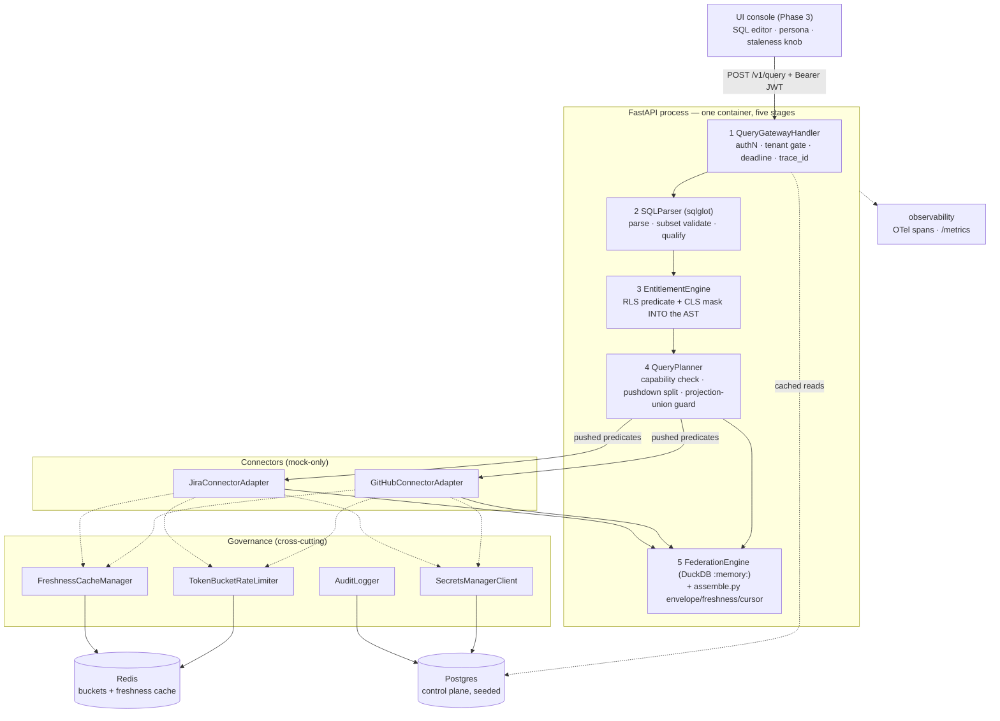

# Architecture — Universal SQL prototype (kickoff v1 / Phase 0)

> **What this document is:** the ADR-format record of decisions already made. Per
> [`../../design/03-BUILD-PROCESS.md`](../../design/03-BUILD-PROCESS.md) step 2, this step's mandate is
> **"formalize, don't re-decide"** — [`../../design/01-EXECUTION-PLAN.md`](../../design/01-EXECUTION-PLAN.md)
> §A (finalized stack, with sources) and §B (deviation log, with reasons) are an ADR set in everything but
> format. ADR-001 … ADR-014 below are that set, converted. They carry status **Accepted (prior decision)** and
> are **not open for re-decision by any later step** — a step that believes one is wrong stops and says so.
>
> **ADR-015 and ADR-016 are different.** They are genuinely new, opened by this session's research pass, and
> were confirmed by the human on 2026-09-28. They are now Accepted and closed on the same terms as the rest.
>
> Evidence sources: `§D` = `01-EXECUTION-PLAN.md` §D research cards →
> [`../../design/research/prototype-prior-art.md`](../../design/research/prototype-prior-art.md);
> `v1-research` = [`./research-repos.md`](./research-repos.md); `spike` = `spike/ast_spike.py`, runtime-executed
> this session.

---

## System overview

**The one-line shape:** the full design's data plane collapsed into a single process, with the control plane
reduced to seeded Postgres. The *stages* are the design; horizontal scale and mTLS are asserted in the README,
not built (HLD §2, §7).

---

## Key decisions

### ADR-001: Python 3.11 + FastAPI as the service runtime
**Status:** Accepted (prior decision — §A) · **Context:** one process must host five pipeline stages, async
connector fan-out, and a typed response contract, inside a take-home budget.

| Option | Source | Pros | Cons |
|---|---|---|---|
| **A: Python 3.11 + FastAPI** ✅ | §A (your `03`) | sqlglot + DuckDB are Python-native; Pydantic types the envelope for free; async fan-out built in | GIL bounds CPU-bound join work |
| B: Go + a SQL parser | novel | true parallelism, single binary | no sqlglot equivalent; the AST rewrite becomes the whole project |
| C: Node + TypeScript | novel | good for the console | weakest SQL-AST and embedded-OLAP ecosystem |

**Why A:** the two irreplaceable libraries (sqlglot, DuckDB) are Python-first. Choosing anything else means
rebuilding ADR-002 from scratch. **Consequences:** +typed envelope at no cost; −CPU-bound joins share a GIL,
mitigated because DuckDB releases it during execution.

---

### ADR-002: sqlglot as the parse / rewrite / plan substrate
**Status:** Accepted (prior decision — §A; hardened by §D Card 1 and corrected by the spike)

| Option | Source | Pros | Cons |
|---|---|---|---|
| **A: sqlglot** ✅ | §D Card 1 | pure-Python typed AST; `qualify()` attributes every column to its source; rewrite + regenerate | pre-1.0 API surface moves |
| B: sqlparse | novel | simple | token stream, not a typed AST — cannot safely inject a predicate |
| C: hand-rolled parser | novel | full control | rebuilds a solved problem; the subset still needs validating |

**Why A:** entitlement must be *compiled into* the query (ADR-010), which requires a typed, rewritable AST.
Card 1's APIs were runtime-verified.

**Binding implementation notes (all verified, not inferred):**
- `qualify(tree, schema, dialect="duckdb")` **must run first** — without it `exp.Column.table` is empty and a
  predicate cannot be attributed to a source (§D Card 1).
- **Do not** use sqlglot's `pushdown_predicates` / `pushdown_projections`; they push *within one AST*, not out
  to independent connectors (§D Card 1).
- Map tables on **`(table.db, table.name)`**, not `catalog` — `github.pull_requests` parses with `catalog=''`.
- **Spike correction to Card 1:** flattening the WHERE must **recurse through `.unnest()`**. `tree.where(pred,
  append=True)` routes through `exp.and_`, which wraps the existing WHERE in an `exp.Paren`; a single
  `flatten()` prunes at the paren, returns the whole nested AND as one leaf, and yields **zero** pushable
  GitHub predicates — silently disabling all pushdown while still returning correct rows. Applied to
  `phases/phase-2-sql-pipeline.md` and the Card 1 text.

---

### ADR-003: DuckDB `:memory:` as the federation / join engine
**Status:** Accepted (prior decision — §A; shape validated by §D Card 3, executed in the spike)

| Option | Source | Pros | Cons |
|---|---|---|---|
| **A: DuckDB `:memory:` per request, sources via `register(pyarrow.Table)`** ✅ | §D Card 3 (universql) | real SQL join/sort/limit/project; Arrow is cheap in and out; `:memory:` needs no teardown | whole result must fit memory |
| B: hand-written hash join in Python | your `01` | no dependency | re-implements sort + limit + null semantics; a correctness liability on the graded join |
| C: SQLite | novel | stdlib | row-store, no Arrow interop, weaker analytic SQL |

**Why A:** HLD §2 collapses the design's two join paths (streaming hash-join / materialized spill) into one
engine — `:memory:` *is* the in-memory path and the spill seam is the `:memory:`→file swap. The README must say
this plainly or the prototype reads as contradicting design §4.4.

**Verified in the spike:** `duckdb.register(name, arrow_table)` → run SQL over registered names works
end-to-end. One correction: on duckdb 1.5.x `.arrow()` returns a `RecordBatchReader`, and `fetch_arrow_table()`
is deprecated — use **`to_arrow_table()`**.

---

### ADR-004: Redis for token buckets and the freshness cache
**Status:** Accepted (prior decision — §A, your `02`/`03`)

| Option | Source | Pros | Cons |
|---|---|---|---|
| **A: Redis** ✅ | §A | atomic Lua for the bucket; TTL native; the same store the real design uses | one more container |
| B: in-process dicts | novel | zero infra | a per-process bucket is not *per-tenant fairness* — it would argue against the design doc |
| C: Postgres rows | novel | one fewer service | row contention on the hot path; no native TTL |

**Why A:** hard part #2 is *fairness across a fleet*. A bucket that lives in one process proves nothing about
the claim. Redis keeps the mechanism honest at prototype scale.

---

### ADR-005: Postgres as the control plane, seeded at boot
**Status:** Accepted (prior decision — §A, your `02`) · The full design's registry / catalog / policy / secrets /
rate-limit / audit stores collapse to **one** Postgres with seeded tables (HLD §2). Alternatives — YAML files
only (no JSONB query, no audit sink) or SQLite (no JSONB, no concurrent writer) — were rejected because the
policy AST (ADR-008) wants real JSONB and `audit_logs` wants a real writer.

**Consequence that Phase 0 must honour:** every control-plane read is **TTL-cached in process**
(`CONTROL_PLANE_TTL_MS`, default 30 000) behind `src/control_plane/repository.py`, with an explicit
`invalidate()` for `/v1/test/reset`. Without it every query pays 4–5 Postgres round-trips and the Phase 4 P95
measures Postgres rather than Jira.

---

### ADR-006: Fernet-encrypted secrets in Postgres, not Vault
**Status:** Accepted (prior decision — §B #4)

| Option | Source | Pros | Cons |
|---|---|---|---|
| **A: per-tenant Fernet key, ciphertext in `secrets`** ✅ | §B #4 (your `03` Option B) | proves indirection + per-tenant key ⇒ crypto-shred, in ~30 lines | not a real KMS boundary |
| B: Vault container | your `03` Option A | production-shaped | a container, an unseal flow, and a policy model for one graded bullet |

**Why A:** hard part #3 is *credential isolation by indirection* — `secret_ref` → decrypt → token, never
inline. Fernet demonstrates exactly that, and the per-tenant key makes key-destroy (crypto-shred) testable.
**Consequence:** the README must map `secret_ref` → Vault KV + KMS, or this reads as a shortcut rather than a
scoped choice.

---

### ADR-007: Mock-only connectors; `BaseConnectorAdapter.fetch()` is the single live seam
**Status:** Accepted (prior decision — §A; contract shape from §D Card 2)

| Option | Source | Pros | Cons |
|---|---|---|---|
| **A: deterministic in-memory mocks behind the real adapter contract** ✅ | §A + §D Card 2 | tests are deterministic; no Jira subscription; 429/timeout/pagination are *triggerable on demand* | does not prove real API quirks |
| B: live GitHub + Jira | novel | realism | external flakiness in every test; rate-limit demo becomes non-deterministic; needs a Jira tenant |

**Why A:** four of the five hard parts need a *forced* failure (a drained bucket, a timed-out source) to be
demonstrated at all. Live APIs cannot be made to fail on cue. HLD §7 names live connectors an explicit
non-goal, with `fetch(predicates, projection, page)` as the one seam a live adapter implements.

**Adopted from §D Card 2 (airbyte-python-cdk):** one `RequestOption` injection primitive
(`{inject_into: query|header|body|path, field_name}`) folded into the capability model; pagination =
strategy ⊕ placement with an explicit stop condition; error mapping as an action-enum + `failure_type` +
default status→action table; `Retry-After`-header-driven backoff.

---

### ADR-008: Policy stored as a JSONB predicate AST, never a SQL string
**Status:** Accepted (prior decision — §B #2, diverging from your `02`)

| Option | Source | Pros | Cons |
|---|---|---|---|
| **A: JSONB predicate AST** ✅ | §B #2, design-doc §3.2 | zero SQL-injection surface; the planner can rewrite **and push it down** safely | needs a small AST→`exp` compiler |
| B: `rls_filter_sql TEXT` | your `02` | trivial to seed | a raw string cannot be safely split per source — it would force post-filtering, breaking ADR-010 |

**Why A:** this is load-bearing, not stylistic. Option B makes the non-negotiable in ADR-011 impossible: you
cannot attribute a predicate to a source without parsing the string you just concatenated.

---

### ADR-009: Equijoin `pr.issue_key = issue.key`, not a fuzzy `LIKE`
**Status:** Accepted (prior decision — §B #1, diverging from your `01`) · Mock PR rows carry a derived
`issue_key`; in production it is extracted from the branch/title, noted as a realism caveat and not built.
A `title LIKE '%'||issue_key||'%'` join was rejected: it is non-deterministic to test, cannot be pushed down,
and desyncs from design-doc §6.1's worked example. **The canonical query is pinned verbatim** (HLD §4 = §6.1) —
changing it desyncs the two submitted deliverables.

---

### ADR-010: Canonical entitlement pair — RLS `assignee = :user`, CLS mask `reporter_email` (`hash`)
**Status:** Accepted (prior decision — §B #3) · Your `01` proposed RLS `repo IN (allowed_repos)` + mask
`assignee`; the design doc's canonical pair wins, because `reporter_email` exists only on Jira issues (PRs have
no reporter) and consistency between the two deliverables matters more than the specific column.

**Rails this ADR pins (HLD §9):** `effect ∈ {allow, deny}` with deny-overrides and default-deny;
`mask ∈ {null, hash, redact, drop}`; **`ENTITLEMENT_DENIED` = an explicit `deny`**, while default-deny (no
matching allow) yields **`empty`, not 403**.

**Two consequences that are easy to get wrong:**
- The canonical query projects four columns and **none is `reporter_email`** — it *cannot* demonstrate CLS. A
  second "CLS demo" preset exists for that one proof. Do not "fix" this by editing the canonical query.
- With `mask: hash` the cell value is an **MD5 digest**, not `••••`. The UI renders from
  `ColumnMeta.masked`, never from the value — verified in the spike, whose masked column came back as
  32-hex digests with no `@` present.

---

### ADR-011: Entitlement is compiled into the plan and pushed down — never post-filtered
**Status:** Accepted (prior decision — `02-DEFINITION-OF-DONE.md` §4 non-negotiable #1; **cautionary** evidence
from §D Card 4)

| Option | Source | Pros | Cons |
|---|---|---|---|
| **A: compile RLS into the WHERE / CLS into the projection before fetch** ✅ | §D Card 1 + DoD §4 | forbidden rows are **never fetched**; the pushed predicate is assertable in a test | the planner must handle non-pushable predicates correctly |
| B: fetch, then filter in Python | §D Card 4 (fastapi-permissions) | trivial | **falsifies the central claim of the design doc** |

**Why this is the sharpest ADR in the set:** Card 4 researched `fastapi-permissions` — a 652★ library whose
"row-level" tagline describes *object-level, post-fetch* checks. Adopting it would have been exactly the
banned pattern. We take only its `configure_permissions` DI-factory shape and its namespaced-principals idea
(`user:bob`, `role:support`), and deliberately reject its core flow. **Being able to say why the obvious
library is wrong here is itself part of the deliverable.**

**Verified in the spike:** with RLS injected, GitHub fetched 7 of 9 rows and Jira 6 of 9 — the excluded rows
never crossed the adapter boundary. Row counts came out alice 3 / bob 1 / carol 0, exactly HLD §6.

---

### ADR-012: Pushdown is an optimization; the engine re-applies every predicate, over a projection-union fetch
**Status:** Accepted (prior decision — DoD §4 non-negotiables #2/#3, plus §B #7)

Three rules, each with a failure mode that motivates it:
1. **Fetch `projection ∪ every WHERE/ORDER BY/JOIN-key column.`** Otherwise the engine's authoritative
   re-filter drops rows it cannot see. *Spike-verified:* Jira fetched `assignee` and `updated` despite
   projecting neither.
2. **Re-apply every predicate in the engine.** A connector that silently ignores a pushed filter must not
   widen the result.
3. **`LIMIT` is applied after the join; `ORDER BY` is re-sorted in-engine** (§B #7) — pushing `LIMIT` through a
   join drops rows that would have joined. Result ordering is
   **`issue.updated DESC, issue.key ASC`**: the tiebreaker is not cosmetic, because the cursor is an offset and
   an offset over a non-total order skips or duplicates rows. `next_cursor` is `null` whenever `partial=true`.
4. **A cross-source predicate is non-pushable by construction** and stays in-engine — *spike-verified*: a
   `pr.author = issue.assignee` leaf correctly fell out as residual.

Also pinned here: **empty ≠ partial ≠ error** (DoD §4 #3) — three envelope shapes, three tests.

---

### ADR-013: `connectors` is a global catalog; `tenant_connector` is the per-tenant grant
**Status:** Accepted (prior decision — §B #6, matching design-doc §8.3) · Your `02` put `tenant_id` and
`base_url` on `connectors`. Splitting them keeps the connector *definition* (type, `version`, `capabilities`
JSONB — data, not code) separate from a tenant's *grant* of it (`enabled`, `status`, `secret_ref`).

**This is what makes take-home lines 29–30 true cheaply:** onboarding a connector is one YAML file in
`config/connectors/` plus one adapter class implementing `fetch()`, and `connectors.version` is a real column.
An admin *console* for it stays a documented non-goal.

---

### ADR-014: Playwright for UI E2E; k6 for load
**Status:** Accepted (prior decision — §A, §B #5) · Playwright because Phase 3's gate is *"the mask is visible
in a browser"*, which only a real browser can assert; k6 because the brief names ~500–1k QPS for 60s
(line 160). Both are SHOULD/MUST-tier respectively — Playwright rides with Phase 3 (SHOULD), k6 is MUST.

**Phase 3 dependency on Phase 0:** the Playwright `beforeEach` calls **`POST /v1/test/reset`** (`TEST_MODE=1`)
to flush Redis buckets and re-seed, so the rate-limit spec is deterministic and does not poison the others.
That route is a **Phase 0** deliverable — it exists this phase precisely so Phase 3 does not have to retrofit it.

---

### ADR-015: `/metrics` is one route we own; take the instrumentator's collectors, decline its route
**Status:** ✅ **Accepted** (confirmed 2026-09-28) — new this session · **Evidence:** v1-research, runtime-probed

**Context.** HLD §4 asks `/metrics` to expose golden signals **and** a per-connector `rate_limit_remaining`
gauge. Phase 0's spec lists `GET /metrics` as a stub and `prometheus-client` as the only dependency.

| Option | Source | Pros | Cons |
|---|---|---|---|
| **A: `.instrument(app)` for collectors + our own route calling `generate_latest(REGISTRY)`** ✅ | v1-research | golden signals free; one endpoint; we control the route's auth/shape | one extra dependency |
| B: `.instrument(app).expose(app)` | v1-research | one line | adds a *second* `/metrics` route competing with the spec'd one |
| C: `prometheus-client` only, hand-write latency middleware | v1-research | one fewer dependency | ~40 lines of histogram middleware to write and test for something off-the-shelf |

**Why A:** runtime-verified that `prometheus-fastapi-instrumentator` defaults to `prometheus_client`'s shared
`REGISTRY` (`instrumentation.py:160-163`), so a hand-declared `Gauge` lands in the *same* scrape —
`rate_limit_remaining{connector="github",tenant="tenant_acme"} 4870.0`. `instrument()` and `expose()` are
separable, so we can take the middleware and keep our own route.

| Dimension | Rating | Notes |
|---|---|---|
| Complexity | 2/5 | two lines in the app factory |
| Time-to-build | 1/5 | minutes |
| Proven-ness | 5/5 | 1,487★, updated this week, source-read |

**Consequences:** +Phase 4 shrinks to the k6 run and artifact capture; −one more pre-1.0-adjacent dependency.
**Risk:** a future version defaulting to a private registry would silently split the scrape — mitigated by a
smoke test asserting both metric families appear in one `/metrics` response.

---

### ADR-016: No OTLP exporter or tracing backend in `docker-compose`
**Status:** ✅ **Accepted** (confirmed 2026-09-28) — new this session · **Evidence:** v1-research

**Context.** Take-home line 161 requires **one trace showing connector time**, captured as a screenshot
(line 52). Every hobby repo in the triage bolted a Jaeger container onto compose.

| Option | Source | Pros | Cons |
|---|---|---|---|
| **A: console / in-memory exporter; render the waterfall from span data** ✅ | v1-research | no fourth container; cold start stays under the 60s gate; artifact is still real | the screenshot is our rendering, not a Jaeger UI |
| B: add a Jaeger container + OTLP exporter | triage repos | a familiar, screenshot-ready UI | a fourth service on a 3-service compose; slower cold start against DoD gate 3 |
| C: no tracing, metrics only | novel | simplest | **fails a MUST** (line 161) |

**Why A:** HLD §7 keeps deployment surface minimal and the submission gate times `make up` cold-to-serving at
**< 60s**. What is graded is that the trace makes *"the P95 was Jira, not the engine"* readable — spans with
parents and durations do that. Runtime-probed: nested spans auto-parent, share one `trace_id`, and carry
start/end times, so the waterfall data is fully present without a backend.

**Consequences:** +compose stays three services; −the artifact is a rendered waterfall rather than a Jaeger
screenshot, which the README must state plainly. **Revisit** if Phase 4 finds the rendering unconvincing —
adding an exporter later is a config change, not a redesign, because ADR-015/016 keep OTel wiring standard.

---

### ADR-017: Identity carries **both** OAuth scopes and SCIM roles, and authorization is layered
**Status:** ✅ **Accepted** (2026-09-28, post-build review) · **Evidence:** RFC 9068 §2.2.3 / §2.2.3.1,
RFC 8693 §4.2, RFC 7643 §4.1.2; take-home line 157

**Context.** `UserContext` originally carried only `roles`. The brief asks for *"user token → **scopes/roles**
→ RLS/CLS"* (line 157, a MUST-tier deliverable), and RFC 9068 gives the two words distinct meanings.

| Option | Source | Pros | Cons |
|---|---|---|---|
| **A: both, with different jobs** ✅ | RFC 9068 | matches the brief and the standard; coarse gating is separable from policy selection | two concepts to keep straight |
| B: roles only | prior state | simpler | fails the brief's line 157; conflates "may you call this API" with "which rows" |
| C: scopes only | novel | one vocabulary | policies key on `applies_to`, which is a role; scopes would have to encode role semantics |

**Why A, and the split:**
- **`scopes`** ← the `scope` claim, a **space-delimited string** (RFC 8693 §4.2, *not* a JSON array — the
  classic JWT bug). Coarse API permission, checked at the gateway.
- **`roles`** ← the `roles` claim (SCIM, RFC 7643 §4.1.2). Selects which policies apply (`policies.applies_to`),
  and so shapes the RLS predicate and CLS mask compiled into the plan.
- **Neither is the design doc's `entitlement_scope`** (design-doc §4.3), which is a *data* scope used as a
  cache-key segment and to resolve set-valued RLS params. Conflating it with the OAuth `scope` would be a
  data-leak vector — it is the "entitlement trap" that keys tenant A's cache away from tenant B.

**The authorization layering this pins** — and the rule that keeps it honest:

| Layer | Question | Where | Failure |
|---|---|---|---|
| L0 | is the token real? | `auth.py` | 401 |
| L1 | is the tenant active? | `deps.enforce_tenant_status` | 403 |
| L2 | may this caller run queries? | `deps.require_scope` | 403 |
| L3 | is the connector granted? | Phase 2 gateway | 403 `CONNECTOR_NOT_ENABLED` |
| L4 | which rows and columns? | **compiled into the plan** | — |

> **An endpoint check may consult the token and the control plane, never a result row.** The moment a decision
> needs data to make, it belongs in the plan. Pulling L4 up to the endpoint is exactly the post-fetch filtering
> `02-DEFINITION-OF-DONE.md` §4 bans, and the mistake research Card 4 records `fastapi-permissions` making.

**Also fixed here (a live defect, not a design choice).** `@dataclass(frozen=True)` is only *shallowly*
immutable: with `roles: list`, `context.roles.append("admin")` succeeded — inside the object whose `roles`
select the RLS policies. Now `tuple` / `frozenset` / `MappingProxyType`, with a test that asserts it.

**Consequences:** +the brief's line-157 gap closes; +`jti` gives the audit trail a join key to a specific
credential. −one more scope constant to maintain; deliberately kept to a single `query:execute` (LAW 5 — no
permission taxonomy before there are consumers).

---

### ADR-018: Spans are exported to JSONL off-thread, still with no tracing backend
**Status:** ✅ **Accepted** (2026-09-28, post-build review) · **Amends ADR-016**

**Context.** ADR-016 chose "console or in-memory exporter, no backend". The built implementation was
`SimpleSpanProcessor` + `ConsoleSpanExporter`, which has two defects that only bite at Phase 4 scale:
export happens **synchronously on the request thread**, so it lands inside the latency k6 is measuring; and
one JSON blob per span floods container stdout at ~500 QPS.

| Option | Pros | Cons |
|---|---|---|
| **A: JSONL file + `BatchSpanProcessor`, sink switchable** ✅ | off-thread; greppable by `trace_id`; *is* the Phase 4 artifact; no new container | a file to mount |
| B: keep console, batch it | one-line change | still floods logs; still no artifact file |
| C: OTLP → Jaeger | best UX | rejected by ADR-016 on the <60s cold-start gate |

**Why A:** it removes the measurement distortion *and* hands Phase 4 a real file to render the waterfall from,
while ADR-016's substance — no tracing backend, three services — is untouched. `OTEL_EXPORTER` selects
`file` (default) / `console` (dev) / `none` (the k6 run, where exporting is overhead on the very number being
measured).

**Consequences:** +Phase 4 renders from a file instead of scraped terminal output; +the `trace_id` in the
JSONL matches the envelope and the access log, so all three correlate. −one bind mount.

---

## Tech stack summary

| Component | Choice | ADR |
|---|---|---|
| Language / API | Python 3.11 + FastAPI + Pydantic v2 | 001 |
| SQL parse / rewrite | sqlglot (`qualify` + manual split) | 002 |
| Join engine | DuckDB `:memory:`, pyarrow as currency | 003 |
| Buckets + cache | Redis | 004 |
| Control plane | Postgres, seeded, TTL-cached reads | 005 |
| Secrets | Fernet ciphertext in Postgres, per-tenant key | 006 |
| Connectors | mock-only behind `BaseConnectorAdapter` | 007 |
| Policy storage | JSONB predicate AST | 008 |
| Join predicate | equijoin on `issue_key` | 009 |
| Entitlement | RLS `assignee=:user`; CLS `reporter_email` (`hash`) | 010, 011 |
| Planning correctness | projection-union guard; LIMIT after join | 012 |
| Catalog model | global `connectors` + `tenant_connector` grant | 013 |
| E2E / load | Playwright · k6 | 014 |
| Observability | OTel spans → JSONL off-thread + one owned `/metrics`, no backend | 015, 016, 018 |
| Identity | OAuth `scopes` (gateway) + SCIM `roles` (policy selection) | 017 |

## Data model

Seven control-plane tables (`001_init.sql`, mirroring design-doc §8.3): `tenants` (status, residency,
`fernet_key`) · `connectors` (global catalog: `version`, `capabilities` JSONB) · `tenant_connector` (grant:
`enabled`, `secret_ref`) · `secrets` (Fernet ciphertext by `secret_ref`) · `policies` (`kind` RLS|CLS,
`effect`, `predicate` JSONB, `column_name`, `mask`) · `rate_limit_policies` (`max_requests`, `window_sec`,
`burst`) · `audit_logs` (one row per query).

**Connector-side data contract** — the field names the adapters must produce, fixed by the canonical query and
verified against the spike's datasets:

| Source | Fields | Notes |
|---|---|---|
| `github.pull_requests` | `id, repo, state, title, author, issue_key` | `repo` is **required** (path param); `issue_key` is the derived join key (ADR-009) |
| `jira.issues` | `key, status, assignee, reporter_email, updated, summary` | `reporter_email` is the CLS target and lives **only** here; `assignee` is the RLS target; `updated` drives the sort |

## Risks & mitigations

| Risk | Likelihood | Impact | Mitigation |
|---|---|---|---|
| A pushdown regression silently disables filtering while still returning correct rows | **Medium** | **High** — falsifies the design doc's central claim | The exact bug the spike caught (ADR-002). Phase 2 asserts *the adapter received the predicate*, not just that rows are right |
| Instrumentation packages are pre-1.0 and must move as a set | Medium | Low | Pin them together in `pyproject.toml`; smoke-test `/metrics` (ADR-015) |
| Cold start exceeds the 60s submission gate | Low | High — DoD gate 3 | Three services only (ADR-016); slim `python:3.11-slim` image; timed on a fresh clone in Phase 4 |
| `src/execution/` grows past the 500-line commit hook | Medium | Medium | `FederationEngine` stays split: `federation.py` (DuckDB) + `assemble.py` (envelope/freshness/cursor) |
| Prototype reads as contradicting design §4.4's dual join paths | Medium | Medium | README states the `:memory:`-stands-for-both collapse explicitly (ADR-003) |

## Status

ADR-001 … ADR-014: **Accepted**, formalized from `01-EXECUTION-PLAN.md` §A/§B — closed to re-decision.
ADR-015, ADR-016: **Accepted**, confirmed 2026-09-28.
ADR-017, ADR-018: **Accepted** 2026-09-28 in the post-build review; ADR-018 amends ADR-016.
All eighteen decisions are now closed to re-decision.

→ Next: step 3, `/spec` → `docs/phoenix-development-workflow/specs/2026-09-28-phase0-scaffold.md`.
