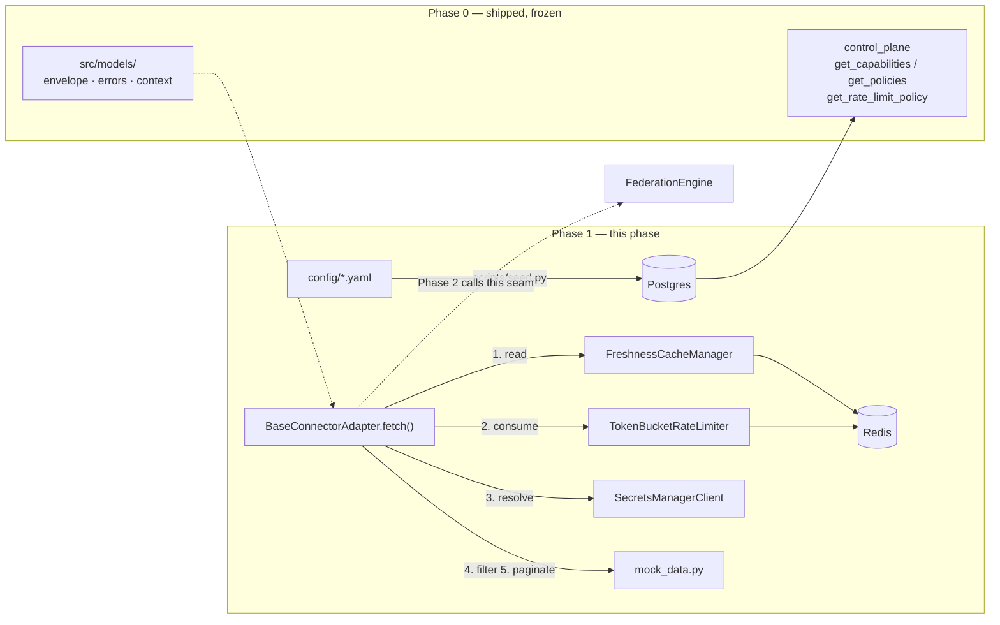

# Architecture — Universal SQL prototype (kickoff v2 / Phase 1)

> **Mandate.** `03-BUILD-PROCESS.md` step 2: *formalize, don't re-decide.* The stack, the connector contract
> shape, the mock-only decision and the Fernet secret store are already Accepted as **ADR-004, ADR-006,
> ADR-007 and ADR-013** in [`../v1/architecture.md`](../v1/architecture.md), which stays the authority for
> everything it covers. Nothing here reopens them.
>
> This file records only the **seven decisions Phase 1 genuinely opened** — six of them because building
> Phase 0 revealed the phase file was written against a codebase that did not yet exist, and one because
> [`research-repos.md`](./research-repos.md) changed a design. The matching corrections are already applied
> at source in `../../design/phases/phase-1-connectors.md`.

## Where Phase 1 sits

The numbered edges are the load-bearing order: **cache read before token consume**. ADR-024 is why.

## Key decisions

### ADR-019: The token bucket takes an injected clock, defaulting to wall-clock epoch ms
**Status:** ✅ **Accepted** (2026-09-28) — new this phase · **Evidence:** v2-research (`PyrateLimiter` ⭐525,
`clocks.py` read in full)

**Context.** The brief names *"token bucket with burst"* (line 158), and the phase file turns that into
`test_bucket_burst`: with `max_requests=5, burst=2`, a cold bucket admits 7 back-to-back, then throttles, and
*after `window_sec/max_requests` of refill exactly one more is admitted*. That last clause is a time
assertion. `tests/unit` runs in the `pytest -q` pre-commit hook.

| Option | Source | Pros | Cons |
|---|---|---|---|
| **A: limiter takes a `now_ms()` callable; tests inject a fake and advance it** ✅ | `PyrateLimiter`'s `AbstractClock` | burst test is instant and exact; no flake | one constructor arg |
| B: `time.time()` inside the limiter; test sleeps the refill interval | — | no arg | **12s sleep** in the commit-hook suite, at `max_requests=5, window_sec=60`; gets worse as budgets grow |
| C: `redis.call('TIME')` inside the Lua script | `limits` (newer scripts) | no client clock skew at all | untestable without a real Redis → the burst test leaves `tests/unit` entirely, and the hook stops covering it |

**Why A:** it is the only option that keeps the phase's own burst assertion inside the hermetic suite the
commit hook runs. `PyrateLimiter` documents the second half of the decision for us — the default must be a
**wall** clock in epoch ms, not monotonic, *"Needed where timestamps are compared across processes or hosts —
a monotonic clock is only meaningful within one machine's boot. Use it for any bucket whose state is shared
through Redis."* Our bucket state is shared through Redis, so monotonic would be silently wrong the moment a
second app replica exists.

| Dimension | Rating | Notes |
|---|---|---|
| Complexity | 1/5 | one default argument |
| Proven-ness | 5/5 | the pattern is the reference library's central abstraction |
| Time-to-build | 1/5 | minutes; it *saves* build time by removing a sleep |

**Consequences:** +the burst behaviour is asserted exactly rather than approximately; +no sleep in the commit
hook. −The client, not Redis, is the time authority, so clock skew across replicas could over- or under-admit;
acceptable at prototype scale and noted in the README's production-mapping section.
**Risk:** a caller forgetting to pass a clock in a test gets the wall clock and a confusing flake — mitigated
by the fake clock living in `tests/unit/conftest.py` as a fixture, so the ergonomic path is the correct one.

---

### ADR-020: One composite bucket key `{tenant}:{connector}`, not three nested buckets
**Status:** ✅ **Accepted** (2026-09-28) — **corrects** `phase-1-connectors.md` · **Evidence:** the shipped
`001_init.sql`

**Context.** The phase file specified `ratelimit:{tenant_id}:{connector_type}:{user_id}` plus two coarser
keys, checked coarsest→finest.

**Why one key — the three-key design has no configuration source.** `rate_limit_policies` is keyed
`(tenant_id, connector_type)` and carries `max_requests`, `window_sec`, `burst`. There is no per-user budget
row and no column to put one in, so the `…:{user_id}` bucket could only ever be handed a **made-up limit**.
A bucket whose capacity is invented is not a fairness mechanism; it is a constant. `02-DEFINITION-OF-DONE.md`
§3 independently reached the same place, tiering nesting as COULD because *"the brief asks for **a** token
bucket with burst; one composite key satisfies it."*

| Option | Source | Pros | Cons |
|---|---|---|---|
| **A: one key per `(tenant, connector)`, capacity straight from the policy row** ✅ | shipped schema | every number traceable to a row; matches the PK; satisfies line 158 | no per-user fairness within a tenant |
| B: three nested keys as specified | phase file | richer story | two of the three limits are fabricated; LAW 5 |
| C: add a `user_id` column to `rate_limit_policies` | novel | makes B honest | schema change + seed data + a demo nobody asked for, to prove a brief requirement already met |

**Consequences:** +every budget in the system is traceable to a seeded row; +`remaining(tenant, connector)`
for the envelope and the `/metrics` gauge is a direct read, with no "which of three buckets do I report"
question. −A single noisy user inside a tenant can exhaust that tenant's budget; that is exactly the DRR
scheduler the design doc describes and the README lists as described-not-built.

---

### ADR-021: Phase 1 data is seeded from YAML by `scripts/seed.py`; there is no seed migration
**Status:** ✅ **Accepted** (2026-09-28) — **corrects** `phase-1-connectors.md` deliverable 2 · **Evidence:**
brief lines 29 and 154; design-doc §6.2 / §8.2

**Context.** The phase file named `002_seed.sql` as a deliverable *and*, four sections later, said
*"Authoring format is **YAML, loaded by the seeder**, not hand-written `INSERT`s."* Both cannot ship.

**Why YAML.** Four reasons, in order of weight:
1. **The brief grades it.** Line 29 asks that admins onboard connectors *"via console or **config**"* and line
   154 asks for a *"minimal policy config"*; design-doc §6.2/§8.2 promise it ships as YAML in the repo. A
   reviewer opening `config/policies.yaml` sees the claim; an `INSERT` in a migration reads as a fixture.
2. **Secrets cannot be static SQL honestly.** Each tenant's mock token is Fernet-encrypted **with that
   tenant's own key** (ADR-006). Static SQL can only carry pre-computed ciphertext, which hides the very
   indirection `test_secret_indirection` exists to prove. The seeder encrypts at seed time.
3. **`make seed` must be re-runnable.** Phase 0 built a `schema_migrations` ledger, so a migration runs
   **once**; a reviewer who reseeds after a demo would silently get nothing.
4. **Onboarding stays "one YAML file + one adapter class"** — the claim line 29 is graded on.

**Consequences:** +migrations stay schema-only from here; +the config files are themselves a deliverable.
−One more entry point to keep green (`scripts/seed.py`), which `make seed` already reserves. The SQL block in
the phase file survives as an illustration of the resulting rows, which is what it says it is.

---

### ADR-022: Build the error **vocabulary** now; defer the error **machinery**
**Status:** ✅ **Accepted** (2026-09-28) · **Evidence:** §D Card 2; DoD §3 COULD list; LAW 5

**Context.** The phase file specifies an airbyte-derived action enum, `failure_type`, a `DEFAULT_ERROR_MAPPING`
keyed by HTTP status, `Retry-After`-driven backoff and a per-connector circuit breaker. DoD §3 tiers that whole
cluster COULD.

| Option | Source | Pros | Cons |
|---|---|---|---|
| **A: split it — enum + `failure_type` + small mapping now; breaker, backoff, retry loop deferred** ✅ | Card 2 + LAW 5 | Phase 2 gets the one distinction it needs; nothing built for statuses that cannot occur | the split has to be explained |
| B: build it all | phase file | matches the design doc literally | the mock makes **no HTTP call** — a status→action table maps statuses that never arrive, and a breaker guards a function that cannot fail transiently |
| C: build none of it, `raise ApiError` directly | DoD tiering | smallest | Phase 2 then re-derives "is this fatal or degradable" from exception types, which is the ad-hoc `try/except` Card 2 warns against |

**Why A.** The test is whether a consumer exists. It does, one phase away and unavoidably: Phase 2 must tell a
**timeout** (→ `partial: true`, `join_status: incomplete`) from an **auth error** (→ fail the query) from a
**throttle** (→ `429` with `Retry-After`). That three-way split *is* `failure_type`, so building it is not
speculative — it is building the thing Phase 2's honest-degradation gate reads. The breaker and the backoff
have no consumer in a mock and get README prose pointing at design-doc §5.

**Consequences:** +`src/connectors/errors.py` stays small enough to read in one screen; +Phase 2's degradation
logic reads a classification instead of catching exception types. −The design doc describes retry machinery
the prototype does not run, so the README must say so plainly rather than letting a reviewer assume it.

---

### ADR-023: Cache TTL is a property of the write; raise `CACHE_TTL_MS` from 60s to 300s
**Status:** ✅ **Accepted** (2026-09-28) — **changes a Phase 0 default** · **Evidence:** DoD §2 hard part 4

**Context.** The phase file fixes the server TTL at `CACHE_TTL_MS`, default **300 000**, and argues the
distinction that matters: *TTL is a property of the **write**, staleness a property of the **read**.* Phase 0
shipped `CACHE_TTL_MS: int = 60000`.

**Why 300s.** DoD §2 makes the freshness demo *"`max_staleness_ms` 0 → 60000 flips `served` `live` → `cache`."*
With a 60s TTL, the entry's lifetime and the demo's staleness threshold are the **same number**, so the hit
depends on which of two 60s boundaries is crossed first — a demo that is a race is not a demo. At 300s the
entry outlives the knob's whole range and `get(key, max_staleness_ms)` alone decides, which is the point the
phase file is making.

**Consequences:** +the staleness knob becomes the only variable in hard part 4. −This changes **three files
Phase 0 owns**, and they must change together or the build goes red: `src/config.py:27`, `.env.example:21`,
and `tests/unit/test_config.py:43`, which asserts the default explicitly. The plan lists all three in one
task for that reason.
**Risk:** editing a passing Phase-0 test to accommodate a Phase-1 change is exactly the move LAW 7 exists to
stop. It is legitimate **here and only here** because the assertion is pinning a *default value that this ADR
deliberately changes*, not weakening a check — the test still asserts an exact number afterwards, and the
number it asserts is the one this ADR argues for. If the change ever requires **loosening** that assertion
rather than restating it, the change is wrong.

---

### ADR-024: The token is consumed **inside `fetch()`, after the cache read** — the limiter is not a route dependency
**Status:** ✅ **Accepted** (2026-09-28) · **Evidence:** v2-research (`fastapi-limiter`); phase file, bolded

**Context.** The idiomatic FastAPI placement, and what `fastapi-limiter` ⭐788 exists to provide, is a route
dependency: `Depends(RateLimiter(...))` runs before the handler.

**Why not here.** A route-level limiter spends a token on **every** request, including ones served entirely
from cache — inverting the order the phase file makes load-bearing, and breaking three things at once: the
"`304` refreshes `fetched_at` without spending a token" guarantee becomes false; the Phase-3
`rate_limit_banner` stops being deterministic; and the Phase-4 load run drains `tenant_acme`'s 5-token GitHub
bucket on request 6 instead of serving from cache. The rate limit models the **downstream API's** budget, and
a cache hit makes no downstream call — so charging for it is not conservative, it is wrong.

What we *do* adopt from `fastapi-limiter` is its boundary: the limiter receives an already-resolved key and
never inspects a request. `TokenBucketRateLimiter` takes `(tenant_id, connector_type)` and imports nothing
from `src/gateway/`.

**Consequences:** +the cache is a genuine budget-preserving layer, which is what makes hard part 4 worth
demonstrating. −Rate limiting is no longer visible at the route, so a reader of `routes.py` cannot see it;
mitigated by the `fetch()` docstring naming the six steps in order, and by `test_cache_hit` asserting *no
token spent* rather than only asserting `served == "cache"`.

---

### ADR-025: `entitlement_scope` is a mandatory cache-key segment from Phase 1, before Phase 2 can fill it
**Status:** ✅ **Accepted** (2026-09-28) · **Evidence:** design-doc §4.3 "the entitlement trap"; HLD §9 rail

**Context.** The cache key is `cache:{tenant_id}:{entitlement_scope}:{connector}:{sha1(normalized_request)}`.
But `entitlement_scope` is a **Phase 2** concept — Phase 1 has no entitlement engine to compute one. The
tempting move is to leave the segment out and add it later.

| Option | Source | Pros | Cons |
|---|---|---|---|
| **A: the key builder takes `entitlement_scope` as a required argument from day one; Phase 1 callers pass the caller's role, Phase 2 swaps in the real scope** ✅ | novel | the segment can never be *forgotten*; the isolation test is real in Phase 1 | Phase 1's value is a placeholder |
| B: add the segment in Phase 2 | — | less to carry | a cache written in Phase 1 and read in Phase 2 would be keyed differently — and the failure mode of a missing scope segment is **serving one user's rows to another**, the exact leak §4.3 names |
| C: make it optional with a default | — | ergonomic | the default *is* the vulnerability, silently |

**Why A:** this is the one place in Phase 1 where a shortcut is a security bug rather than a rough edge. A
required positional argument makes "I forgot the scope" a `TypeError` at import-adjacent time instead of a
cross-tenant read at runtime. `test_cross_tenant_isolation` asserts **both** segments are literally present in
the constructed key, not merely that two tenants happen to miss each other's entries — a test that only checks
the miss would pass against a key scheme that leaks for a different pair of users.

**Consequences:** +Phase 2 changes one call site, not a key scheme. −Phase 1's placeholder scope must be
documented as a placeholder, or a reader will think the entitlement engine already exists.

---

## Decisions this phase explicitly did NOT make

| Non-decision | Where it is settled |
|---|---|
| Redis / Fernet / Postgres / mock-only connectors | ADR-004, ADR-006, ADR-005, ADR-007 (v1) |
| `RequestOption`; pagination = strategy ⊕ placement | §D Card 2 — adopted as specified, not re-surveyed |
| `connectors` global vs `tenant_connector` per-tenant | ADR-013 (v1) |
| The RLS/CLS rule pair the seed writes | ADR-010 (v1) — Phase 1 only *loads* it; Phase 2 compiles it |
| Anything about SQL, planning or the join | Phase 2. No adapter here is called through SQL. |

## Risks & mitigations

| Risk | Likelihood | Impact | Mitigation |
|---|---|---|---|
| Cache-before-token order regresses during a later refactor | med | high — silently breaks hard parts 2 and 4 together | `test_cache_hit` asserts *no token was spent*, not just `served=="cache"`; the assertion fails on reorder |
| Fake clock leaks into production config | low | high | the clock defaults to wall time; only tests pass a fake, via a `conftest.py` fixture |
| Mock datasets drift from the persona row counts the demo claims | med | med — the RLS demo stops being 3→1 | `mock_data.py` is asserted directly: a test pins alice=3, bob=1, carol=0 before any adapter runs |
| Seeder is not idempotent, so a second `make seed` fails or doubles rows | med | low | every upsert is `ON CONFLICT DO UPDATE`; a test seeds twice and asserts identical row counts |

## Status

Seven ADRs, all Accepted. Phase 1 architecture settled → `/spec`.

---

### ADR-026: Connector credentials are generated at seed time; no Vault container
**Status:** ✅ **Accepted** (2026-09-28, raised in review) · **Refines ADR-006**, does not overturn it

**Context.** Phase 1 first shipped `config/grants.yaml` with a literal `token:` per grant
(`mock-github-pat-acme-000000000001`), encrypted into Postgres at seed time. Reviewed as *"it looks bad for a
demo — can we use HashiCorp Vault or another container instead?"* The concern is right: a reviewer opening
that file sees a credential committed to git, and Security is 15% of the rubric.

| Option | Pros | Cons |
|---|---|---|
| **A: generate per grant at seed time; `grants.yaml` carries only `secret_ref`** ✅ | no literal anywhere in the repo; nothing for a secret scanner to flag; still 3 containers and a 9s cold start; crypto-shred untouched; `secret_ref` indirection unchanged | the demo cannot quote a token value — which nothing needed |
| B: Vault dev container holding the tokens | production-shaped; makes the design doc's Vault story literal | **does not remove the plaintext** (see below); costs `test_crypto_shred`; a 4th always-on container; reopens a locked ADR and the submitted doc |
| C: leave the literals with a header comment | zero work | first impression of `grants.yaml` is a credential in git |

**Why A — and why B does not actually solve the stated problem.** Moving the value into Vault *relocates* the
plaintext, it does not remove it: something must still write the token into Vault (a seed script, an `.env`),
and Vault dev mode needs `VAULT_DEV_ROOT_TOKEN_ID` in `docker-compose.yml`. The trade is an obviously-fake
mock PAT for a **root token**, which reads as worse, not better. This is not an implementation detail — every
secrets system has a root of trust that must come from outside itself (an IAM role, an instance identity, a
TPM). A demo repository has no outside, so the recursion never bottoms out. The only way to have no literal
credential is to have no credential.

Two further costs specific to this prototype made B worse than it looks:

1. **It would cost `test_crypto_shred`.** Vault KV has no per-tenant key to destroy. The current design works
   *because* the Fernet key lives on the tenant row: delete it and that tenant's ciphertext is permanently
   unreadable while every other tenant is unaffected. Replicating that needs Vault's **Transit** engine with a
   key per tenant — materially more than `vault kv put`, to restore a property we already have.
2. **It contradicts what is being submitted.** Vault is a named non-goal in HLD §161 and ADR-006 rejected it
   by name; ADR-016 separately refused a 4th container on cold-start grounds. Adopting it means changing the
   Google Doc, not just the code.

**The test got stronger, not weaker.** The old assertion pinned a literal — `resolve("tenant_acme/github") ==
grants.yaml[0]["token"]` — which only proves someone typed the same string in two files. The property that
actually constitutes credential isolation is that two tenants resolve to **different** values and that each
resolution is **stable**. Both are now asserted, plus that no two grants anywhere collide.

**Consequences:** +no literal credential exists in the repository, so there is nothing to mistake for a real
one and nothing for a scanner to flag; +`make seed` rotating every token on each run demonstrates that
`fetch()` resolves through `secret_ref` every time rather than through a value captured at startup;
+generated values are prefixed `mock_` so one appearing in a log cannot trigger a false incident.
−The demo cannot quote a token value, which nothing needed. −Re-seeding mid-demo rotates credentials; harmless
because no plaintext is cached, and asserted by `test_reseeding_rotates_the_credential`.
**Guard:** `scripts/seed.py` **refuses to seed** if any grant declares a `token:` field, and
`test_grants_yaml_declares_no_credential` fails independently — so a pasted real credential cannot reach the
repository via a successful seed.
