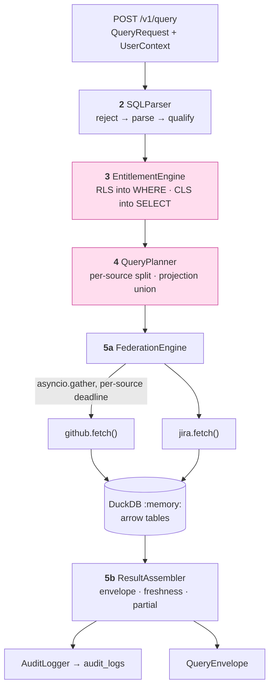

# Architecture — Universal SQL prototype (kickoff v3 / Phase 2)

> **Mandate.** `03-BUILD-PROCESS.md` step 2: *formalize, don't re-decide.* The substrate for this phase is
> already Accepted — **ADR-002** (sqlglot), **ADR-003** (DuckDB `:memory:`), **ADR-008** (JSONB predicate
> AST), **ADR-009** (equijoin), **ADR-010** (the canonical RLS/CLS pair), **ADR-011** (compiled, never
> post-filtered) and **ADR-012** (pushdown is optimization; projection-union fetch) in
> [`../v1/architecture.md`](../v1/architecture.md). Nothing here reopens any of them; **ADR-011 and ADR-012
> are the two this phase exists to make true in code.**
>
> Recorded below are the **ten decisions Phase 2 genuinely opened**. Five come from the runtime probe in
> [`research-repos.md`](./research-repos.md); three from contradictions the phase file carried; two from
> watch-outs Phase 0 and Phase 1 deliberately left open. Every matching correction is applied at source in
> `../../design/phases/phase-2-sql-pipeline.md`.

## Where Phase 2 sits



The two shaded stages are the claim the design doc rests on: entitlement is **in the plan** by the time the
planner splits it, so the RLS predicate rides pushdown to the source and the forbidden rows are never
requested. Measured in the probe: the Jira fetch shrinks 9 → 3 → 1 by persona.

## Key decisions

### ADR-027: The node whitelist runs **before** `qualify()`, not after
**Status:** ✅ **Accepted** (2026-09-28) · **Evidence:** v3-research Finding 1 (measured)

**Context.** The phase file gives two instructions that the probe shows cannot both hold: *"Qualify FIRST
(mandatory)"*, and *"the whitelist … catches `exp.Star` (reject `SELECT *`)"*. `qualify()` **expands** a
star against the schema, so `exp.Star` no longer exists in the tree a post-qualify validator would walk.

**Decision.** Three ordered steps inside `SQLParser.parse_and_validate`:

1. `parse_one(sql, read="duckdb", into=exp.Select)` — the `into=` form raises `ParseError` on `INSERT` /
   `DROP` before any walk, which is free DDL rejection (probe-confirmed).
2. **Reject** — walk the raw AST against the node whitelist. This is where `Star`, `Subquery`, `Union`,
   `Group`, `Like` and arbitrary `Func` die.
3. **Qualify** — `qualify(tree, schema=…, dialect="duckdb")`, whose `validate_qualify_columns` then gives
   free unknown-column validation.

"Qualify first" remains true of everything it was actually about: column *attribution*, which only stages
3–5 need. It was never a claim about validation order.

**Consequences:** +`SELECT *` is rejected, so projection pushdown can never be silently defeated.
+DDL/DML is rejected one step earlier and more cheaply. −The whitelist must include the structural nodes
sqlglot always emits (`Identifier`, `TableAlias`, `Ordered`), which the phase file's sketch omitted; the
measured node set in v3-research Finding 4 is the source of truth, not the sketch.

---

### ADR-028: Malformed SQL raises `InvalidQueryError` → **400 `INVALID_QUERY`**, deliberately outside the six codes
**Status:** ✅ **Accepted** (2026-09-28) · **Evidence:** design-doc §8.1 (the full table); `models/errors.py` precedent

**Context.** The phase file says a subset violation is *"top-level `400` (distinct from empty)"* and
`test_trichotomy` requires *"error (malformed SQL → HTTP 400, no envelope rows)"* — but names no code. The
vocabulary has none: design-doc §8.1 lists exactly six, and every one of them describes entitlement,
throttling, freshness or connector state. None describes *"your SQL is not in the supported subset"*.

**Options.** (a) Reuse `ENTITLEMENT_DENIED` — wrong and actively harmful: it tells a caller to request
access for what is a typo, and it pollutes the vocabulary the design doc shares. (b) Add a seventh code —
`models/errors.py` says in its own docstring that *"adding a seventh means changing the design doc"*.
(c) A separate exception type outside the enum.

**Decision.** (c), on the precedent already set and documented in `models/errors.py`: `UnauthenticatedError`
is **401 `UNAUTHENTICATED`** and is deliberately *not* an `ErrorCode`, because *"diluting the six with
transport failures desyncs the two deliverables."* A malformed query is the same kind of thing — a
request-shape failure, not a domain outcome. `InvalidQueryError` gets `error_code = "INVALID_QUERY"`,
`http = 400`, and a handler alongside the existing two.

**Consequences:** +the six-code vocabulary stays byte-identical to design-doc §8.1, so no submitted document
changes. +`test_trichotomy`'s error leg has a name. −a caller now learns eight strings, not six; mitigated
because the two extras are both transport/request-shape and are documented as such in one place.

---

### ADR-029: `CONNECTOR_AUTH_ERROR` is **403**, correcting Phase 1's 502
**Status:** ✅ **Accepted** (2026-09-28) · **Evidence:** HLD §4, design-doc §8.1 + §4.5 — both say 403

**Context.** Phase 1's `src/governance/secrets.py` raises `ApiError(CONNECTOR_AUTH_ERROR, http=502)` on
every failure path. Three locked documents say otherwise, in the same words each time:

| Source | Says |
|---|---|
| HLD §4 error vocabulary | `CONNECTOR_AUTH_ERROR` **(403, gateway)** |
| design-doc §8.1 reference table | `CONNECTOR_AUTH_ERROR` \| **403** \| *a connector's stored credential is invalid/revoked* |
| phase-2 file, `test_connector_gates` | *"a granted connector whose seeded secret fails to decrypt → **403** `CONNECTOR_AUTH_ERROR`"* |

HLD §9 lists the error vocabulary as a provenance rail — *"every value below is fixed and must be identical
across the design doc, this HLD, and all phase specs."* 502 is a Phase 1 drift from a locked rail, and
Phase 2 is the phase that surfaces it, because Phase 2 is the first phase to render this code over HTTP.

**Decision.** Change `secrets.py` to 403 and update its tests. The reasoning behind 403 is also the better
one: a revoked credential is not *our* server erring, it is *this tenant's connector* being unusable, and
the caller action is administrative ("reconnect GitHub") rather than "retry later" — which is exactly what
403-vs-502 communicates.

**Consequences:** +one HTTP code per error code, so the gateway and the in-fetch path cannot disagree.
+design-doc §8.1 needs no edit. −a Phase 1 file changes during Phase 2, which the phase-disjointness table
in `03-BUILD-PROCESS.md` did not anticipate; accepted, because the alternative is shipping a prototype that
contradicts the document it is submitted with.

---

### ADR-030: Arrow schemas are built from the **capability model**, never inferred from rows
**Status:** ✅ **Accepted** (2026-09-28) · **Evidence:** v3-research Finding 3 (measured crash)

**Context.** `universql` (Card 3) registers `pyarrow.Table`s built with `from_pylist(rows)`, which infers
the schema from the data. The probe shows what that costs on an empty result:

```
pa.Table.from_pylist([])   -> 0 columns
con.register("t", empty)   -> InvalidInputException: must have at least one column
```

Every zero-row path in Phase 2 reaches this: a denied resource, an RLS binding that matches nothing, a
timed-out source contributing no rows to a `partial` answer. carol — the `empty` leg of the trichotomy —
is one join away from it.

**Decision.** `FederationEngine` builds an explicit `pa.schema(...)` from `columns_to_fetch` (which the
planner derives from the capability model) and passes it to `from_pylist` always, not only when the row
list is empty. Types come from the capability model's declared column types, defaulting to `pa.string()`.

**Consequences:** +the empty and partial paths are structurally incapable of crashing the engine, and the
`empty` leg of the trichotomy is a first-class case rather than an accident of there happening to be a row.
+the registered table's columns are exactly the projection-union set, which makes non-negotiable #2 visible
in a schema instead of only in a test. −numeric columns arrive as strings unless declared; `number` is the
only one and it is not compared numerically anywhere in the canonical query.

---

### ADR-031: Explicit `deny` → **403**; default-deny → **empty**. Two outcomes, two tests
**Status:** ✅ **Accepted** (2026-09-28) · **Evidence:** HLD §9 rail; phase file §Stage-3; fixes a phase-file contradiction

**Context.** The phase file states the split correctly in prose (*"an explicit `effect='deny'` … → 403
`ENTITLEMENT_DENIED`"*, *"no matching allow … → empty, not 403"*) and then contradicts it in its own test
list: `test_deny_overrides` said *"a `deny` policy on a resource → **empty** for that resource even if an
allow also matches."* Both cannot be true of the same input.

**Decision.** The prose wins — it matches the HLD §9 rail verbatim. The test list is the bug and is fixed at
source. The two tests are split by *level*, so neither duplicates the other:

| Test | Level | Asserts |
|---|---|---|
| `test_deny_overrides` | unit, `EntitlementEngine` | deny **and** allow both match → the resource lands in `denied_resources`; allow does not win |
| `test_entitlement_denied` | route, end-to-end | that state renders as **403 `ENTITLEMENT_DENIED`**, not an empty 200 |

**Consequences:** +`ENTITLEMENT_DENIED` becomes reachable, so it stops being a declared-but-dead code.
+"empty" keeps meaning *"ran fine, nothing matched"*, which is what makes the trichotomy honest.
−default-deny returning an empty 200 can look like a bug to a caller who expected a grant; mitigated by
the README naming the distinction, since it is a deliberate design position rather than an oversight.

---

### ADR-032: The per-request deadline is enforced **per source** with `asyncio.wait_for`, and a breach degrades to `partial`
**Status:** ✅ **Accepted** (2026-09-28) · **Evidence:** Phase 0 handoff watch-out #2; brief line 84

**Context.** Phase 0 set `request.state.deadline_ms` in `routes.py` and **nothing ever read it** — recorded
as an explicit watch-out at handoff. Meanwhile the phase file's only timeout test drives the `fail_next`
hook, which raises synchronously. Shipping only that would mean "timeouts → partial results" is
demonstrated by an exception we throw ourselves, and a genuinely slow source would hang the request.

**Decision.** `FederationEngine` wraps each `adapter.fetch()` in `asyncio.wait_for(..., timeout=budget)`
inside an `asyncio.gather(..., return_exceptions=True)`. The per-source budget is derived from
`REQUEST_TIMEOUT_MS`, so the request deadline is the parent of the per-source budgets exactly as the
`routes.py` docstring already claims. A `TimeoutError` becomes `SourceOutcome(state="timeout")` +
`partial=True`, never a 500.

`return_exceptions=True` is load-bearing: the default would cancel the *other* source's fetch the moment
one failed, so a Jira timeout would discard the GitHub rows we already had — turning a `partial` answer
into an `error` one, which is the trichotomy collapsing.

**Consequences:** +both timeout paths exist — a real deadline breach and the deterministic `fail_next`
hook — and both land in the same envelope shape, so the demo and the reality agree. +the deadline stops
being decorative. −a slow-but-correct source now yields `partial` rather than a late-but-complete answer;
that is the brief's requirement (line 84), not a regression.

---

### ADR-033: `audit_logs.query_text` stores the **normalized** SQL, never the caller's literals
**Status:** ✅ **Accepted** (2026-09-28) · **Evidence:** Phase 0 handoff watch-out #3; design-doc §3.4

**Context.** The audit row is the compliance access trail. The schema has `query_text TEXT`, and the obvious
implementation writes `request.sql`. But the canonical CLS rule exists to stop `reporter_email` reaching the
caller — and a query reading `WHERE issue.reporter_email = 'dana@acme.com'` would write that exact address
into `audit_logs`, in plaintext, forever. The masking layer would be defeated by the logging layer.

**Decision.** Write `sqlglot`'s normalized form with literals replaced by `?`, produced from the AST we
already hold rather than by a regex over the string. `sources_accessed`, `rows_returned`, `trace_id` and
`execution_ms` carry the forensic value; the literal values are the one part with no audit purpose and a
real disclosure cost.

**Consequences:** +the audit trail cannot become a PII side-channel around CLS. +normalized text also groups
naturally, so "which query shapes are hot" is answerable from the same column. −an auditor cannot replay the
exact query from the log alone; acceptable, and the shape plus `trace_id` is what an access trail is for.

---

### ADR-034: Stage 5 is **two modules** — `federation.py` (DuckDB) and `assemble.py` (the contract)
**Status:** ✅ **Accepted** (2026-09-28) · **Evidence:** phase file §Stage-5; code-quality LAWs 1 and 3

**Context.** As originally specced, stage 5 owned fetch orchestration, DuckDB execution, envelope assembly,
freshness computation, `join_status`/`partial`, and cursor pagination — six responsibilities, comfortably
over 500 lines, which the pre-commit hook hard-blocks.

**Decision.** Formalize the split the phase file already proposes. `FederationEngine` *knows DuckDB and
nothing about the envelope*; `ResultAssembler` *knows the contract and nothing about DuckDB*. The seam is a
plain dataclass carrying raw rows, column types and the per-source `AdapterResponse`s.

**Consequences:** +each file stays well under the limit and has one reason to change. +Phase 3 and Phase 4
consume `ResultAssembler`'s output without ever importing DuckDB. −one more hop to read through; mitigated
because the hop is exactly the boundary between "how we computed it" and "what we promise about it".

---

### ADR-035: Two Jira rows are given a **tied `updated` value**, so the pagination tiebreaker test can fail
**Status:** ✅ **Accepted** (2026-09-28) · **Evidence:** measured — `duplicate updated values: NONE`

**Context.** HLD §9 makes `ORDER BY issue.updated DESC, issue.key ASC` a provenance rail and explains why:
*"the pagination cursor is an offset, and an offset over a non-total order skips or duplicates rows."* The
phase file accordingly requires *"at least two rows sharing the same `updated` value, so the run fails if
the `key` tiebreaker is missing."* Phase 1's `mock_data.py` has **twenty distinct timestamps and no ties**.
So `test_pagination` would pass identically with the tiebreaker deleted — a test that cannot fail.

**Decision.** Give `SUP-13` and `SUP-14` — two of alice's three In-Progress issues — the same `updated`
value. Changing a timestamp changes no row's *membership* in any persona's result, so the alice 3 / bob 1 /
carol 0 contract is untouched; it only makes the ordering non-total within alice's page, which is precisely
the condition the tiebreaker exists for.

**Consequences:** +`test_pagination` gains the ability to fail, which is the only thing that made it worth
writing. +the tie sits inside the *smallest* persona result, so it is exercised by the headline demo rather
than only by a synthetic case. −`mock_data.py` (Phase 1) is edited during Phase 2; the file's own docstring
already declares the persona counts as the contract, and those are preserved.

---

### ADR-036: The result cursor reuses `connectors/pagination.py`'s token codec under a `"result"` strategy
**Status:** ✅ **Accepted** (2026-09-28) · **Evidence:** code-quality LAW 2 (import before invent)

**Context.** Phase 2 needs an opaque offset cursor over the joined rows. Phase 1 already built exactly that
codec — `encode_token(strategy, offset)` / `decode_token(token, expected_strategy)` — opaque, versioned,
URL-safe, and raising rather than falling back to offset 0 on a malformed token (LAW 4).

**Decision.** Reuse it with `strategy="result"`. The strategy tag is not decoration: it is what makes a
*connector-level* GitHub cursor, handed back as a *result-level* cursor, get rejected instead of silently
reinterpreted as an offset into a different row set — which would return real rows for the wrong question.

**Decision, second half.** `next_cursor` is `None` whenever `partial=True`. This is already enforced
structurally by `QueryEnvelope`'s `model_validator`, so the assembler cannot forget it; the test asserts the
behaviour end-to-end rather than re-asserting the validator.

**Consequences:** +one cursor implementation, one set of failure semantics, two call sites. +the
version/strategy guards come free. −the two pagination levels look similar in the envelope and could be
confused by a reader; the README's envelope walkthrough names which is which.

---

## Decision summary

| ADR | Decision | Opened by |
|---|---|---|
| 027 | whitelist before `qualify()` | probe: qualify expands `*` |
| 028 | `INVALID_QUERY` / 400, outside the six | vocabulary gap |
| 029 | `CONNECTOR_AUTH_ERROR` is 403, not 502 | Phase 1 drift from a locked rail |
| 030 | Arrow schema from capabilities, not rows | probe: register() crashes on 0 columns |
| 031 | explicit deny → 403; default-deny → empty | phase-file self-contradiction |
| 032 | per-source `wait_for`; breach → partial | Phase 0 watch-out #2 |
| 033 | normalized `query_text` in `audit_logs` | Phase 0 watch-out #3 |
| 034 | stage 5 split into two modules | LAW 1 / LAW 3 |
| 035 | tied `updated` value in the mock data | test that could not fail |
| 036 | reuse the Phase 1 cursor codec | LAW 2 |

## Status
Accepted. → `docs/phoenix-development-workflow/specs/2026-09-28-phase2-sql-pipeline.md`.
