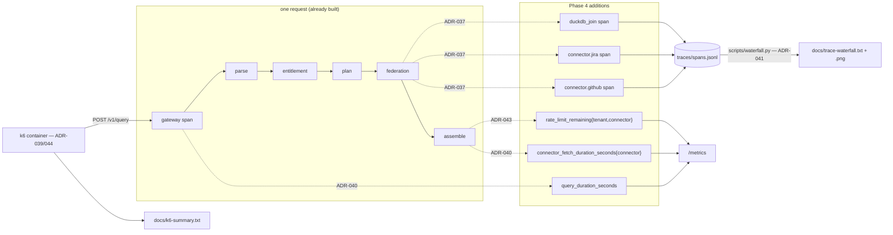

# Architecture — Phase 4: observability, load & artifacts

> **Mandate (`03-BUILD-PROCESS.md` §2): formalize, don't re-decide.** The stack is locked — OTel + Prometheus
> + k6 are all named in §A. What is genuinely open in this phase is *shape*, not *choice*: where the missing
> spans go, how the load harness runs without a host toolchain, and how a trace artifact is produced when
> ADR-016 deliberately declined a tracing backend.
>
> Nine ADRs, **037–045**, continuing v3's numbering. All Accepted. Each cites a v5 probe finding (F1–F6) or a
> locked document.
>
> **One decision here deviates from the phase file** — ADR-042, the audit write. It is recorded as a deviation
> with its reasoning rather than quietly taken, per the build process's own rule.

---

## System overview — what Phase 4 adds

---

### ADR-037: The missing spans go **inside `FederationEngine`**, not around it

**Status:** Accepted

### Context

`phase-4-observability.md` specifies a seven-span waterfall. Probe **F3** measured five: `src/pipeline/runner.py`
wraps the five pipeline stages, and nothing inside `src/execution/federation.py` is instrumented. The result is
one opaque `federation` span containing both connector fetches *and* the DuckDB join — so the phase's own
"Done when" sentence, *"reads the trace to see 'P95 was Jira not the engine'"*, cannot be read off the trace at
all.

The timing is not missing; only the span is. The envelope already carries
`stats.connector_ms = {github: …, jira: …}` from `SourceFetch.elapsed_ms`.

### Options considered

| Option | Source | Pros | Cons |
|---|---|---|---|
| A: `start_as_current_span` inside `run()` and around `_join` | ADR-018's own decorator pattern | Spans open exactly where the work happens; parallel fetches nest correctly under `federation` | Three inline `with` blocks in a module that had none |
| B: Decorate `_fetch_one` / `_join` with `@stage_span` | the existing `stage_span` helper | One line each | `stage_span` takes a **static** name. The two fetches differ only by connector, so both would be named `connector` and collapse into one indistinguishable pair |
| C: Synthesize spans in the assembler from `connector_ms` | novel | No change to `federation.py` | Fabricated spans with invented start times. The waterfall's whole value is *when* things overlapped — parallel fetches would render as sequential. A trace that lies about concurrency is worse than no trace |

### Decision

**Option A.** Inside the per-source `run()` closure, open `connector.{connector_type}`; around the DuckDB
execution, open `duckdb_join`. Both set `stage.elapsed_ms`, the same attribute the five existing stage spans
use, so one renderer reads all seven.

The span opens **inside** the `asyncio.gather` closure deliberately: OTel's context propagates into the
coroutine, so each fetch's span is parented to `federation` and the two siblings carry genuinely overlapping
start/end times. That overlap *is* the evidence that the federation is parallel — the single most load-bearing
claim the waterfall makes.

### Consequences

- **Positive:** the seven-span waterfall exists; concurrency is visible; `connector_ms` and the span durations
  come from the same measurement and cannot disagree.
- **Negative:** `federation.py` grows ~10 lines and gains an observability import. It is at 377 lines; LAW 1's
  decompose-at-400 threshold is close enough to check after the edit.
- **Risk:** a span opened around a `wait_for` that times out must still close. Handled by `with`, verified by a
  test asserting the timeout path still emits `connector.jira`.

---

### ADR-038: The mocks simulate latency — on the **live path only**, defaulting to **off**

**Status:** Accepted · *closes a gap against a locked document*

### Context

Probe **F4**: `grep -rn "asyncio.sleep\|latency" src/connectors/` returns nothing, and a live canonical query
measures `connector_ms: {github: 2.05, jira: 2.05}`.

Two locked statements assume otherwise:

- **HLD non-goals, line 39:** *"Mock connectors with deterministic datasets + simulated pagination/latency/429."*
- **`phase-4-observability.md`:** *"…so cache hits dominate (the run should not be measuring the mock's
  simulated latency)"* — presupposing it exists.

With both sources at 2 ms, the honest reading of the waterfall is *"the connectors are free, DuckDB is the
cost"* — the inverse of both the intended story and of how any real federated query behaves, where the remote
call dominates by two orders of magnitude.

### Options considered

| Option | Pros | Cons |
|---|---|---|
| A: Fixed per-adapter latency, applied after the cache check, default 0, enabled by compose | Closes the HLD claim; keeps `make test` instant; cache hits stay honest-fast | One more setting |
| B: Randomized latency (jitter) | Looks more like a real API | Non-deterministic. Phase 1 chose deterministic datasets precisely so tests never flake; a random sleep re-imports the flakiness through the back door |
| C: Leave it; note the gap in the README | Zero code | Ships a trace artifact that argues against the design doc. The gate is *"reads the trace to see P95 was Jira"* — unmeetable |
| D: Latency before the cache check | Simpler placement | Destroys the cache-hit demo (a hit would cost the same as a live fetch) **and** makes the k6 run measure sleeps instead of the engine, which the phase file explicitly forbids |

### Decision

**Option A.** A `simulated_latency_ms` class attribute per adapter — **GitHub 40 ms, Jira 180 ms** — applied
with `await asyncio.sleep()` at the point in `fetch()` where the HTTP call would happen: *after* the cache
check and *after* the token consume, *before* the predicates are applied. Scaled by a `MOCK_LATENCY_SCALE`
setting that defaults to **0.0** (off) so the unit suite and the commit hook stay instant, and is set to `1.0`
in `docker-compose.yml` so the running stack is realistic.

Jira is the slower of the two on purpose: it is the source carrying the RLS predicate and the CLS mask, so
"the entitled source is also the slow one" is the shape a reviewer should see.

**Placement is the load-bearing part.** After the cache check means a cache hit is still ~0.4 ms, which keeps
ADR-023's staleness demo and ADR-024's cache-before-token ordering intact, and keeps the k6 profile measuring
the engine rather than the sleeps.

### Consequences

- **Positive:** HLD line 39 becomes true; the waterfall tells the story the phase file claims; the
  cache-hit-vs-live contrast gets *sharper* (180 ms → 0.4 ms is legible where 2.05 ms → 0.4 ms is noise).
- **Negative:** Phase 4 edits a Phase 1 module. Justified: it closes a locked claim rather than adding scope,
  and Phase 4 is the phase where the gap has consequences.
- **Risk:** the per-source deadline is 80% of `REQUEST_TIMEOUT_MS` (5000 ms), so 180 ms is nowhere near it.
  The forced-timeout demo uses `fail_next`, not latency, so it is unaffected.

---

### ADR-039: The k6 script takes **zero remote imports**

**Status:** Accepted

### Context

The near-universal k6 idiom for a readable summary is
`import { textSummary } from 'https://jslib.k6.io/k6-summary/0.0.2/index.js'`. Probe **F1** established that
`data.metrics.<name>.values` already contains `min/med/max/avg/p(90)/p(95)`, and that `handleSummary` can write
straight through a bind mount.

### Options considered

| Option | Source | Pros | Cons |
|---|---|---|---|
| A: Render the summary in plain JS inside the script | F1 | No network, no CDN, no version pin to a third party | ~30 lines of formatting code |
| B: `import` jslib's `textSummary` over HTTPS | k6 docs / community default | Familiar output | **`make load` fails with no network.** Couples a graded submission artifact to a CDN's uptime, and does so invisibly |
| C: `k6 run --summary-export=file.json` | k6 CLI | One flag | Deprecated, and emits JSON. `docs/k6-summary.txt` is read by a human reviewer |

### Decision

**Option A.** The only imports are `k6/http` and `k6` (`check`, `sleep`). `handleSummary` formats the numbers
itself and returns both `stdout` and `/artifacts/k6-summary.txt`.

The fresh-clone rule in the phase file — *"anything a reviewer must install by hand is a bug"* — extends
naturally to *anything a reviewer must be online for*. A load test that only runs with internet access is a
load test that fails on a plane, and it fails in the confusing way: a remote import error, not a load result.

### Consequences

- **Positive:** `make load` works offline, on a fresh clone, with only Docker.
- **Negative:** we own ~30 lines of number formatting.
- **Risk:** our formatter diverges from what a k6 user expects to see. Mitigated by printing the raw
  `data.metrics` percentiles verbatim rather than recomputing anything.

---

### ADR-040: Two histograms are **ours**; the golden signals keep the **library's** label names

**Status:** Accepted

### Context

The phase file names four metrics. Probe **F6** measured what exists:

| Named in the phase file | Reality |
|---|---|
| `http_requests_total{route,code}` | **exists**, but labelled `{handler,method,status}` — the instrumentator's defaults |
| `query_duration_seconds` histogram | **missing** |
| `connector_fetch_duration_seconds{connector}` | **missing** |
| `rate_limit_remaining{tenant,connector}` | declared, **never fed** (see ADR-043) |

### Decision

**Add the two missing histograms under exactly the names the phase file states. Do not rename the
instrumentator's labels; correct the phase file instead.**

Matching `{route,code}` would mean replacing `prometheus_fastapi_instrumentator.metrics.default()` with
hand-written collectors purely to change two label spellings — cost with no behavioural gain, and it would move
the golden signals onto a code path nothing else exercises. The label names are a documentation detail; the
*existence* of per-connector timing is the graded deliverable.

`query_duration_seconds` is observed in the route, not in the runner: it must include the entitlement failures
and the 400s, which never reach the runner at all. A histogram that only counts successes would make the P95
look better than it is, which is the specific failure mode a latency metric exists to prevent.

`connector_fetch_duration_seconds{connector}` is observed where `SourceFetch.elapsed_ms` is already computed,
so the histogram, the span (ADR-037) and `stats.connector_ms` are three views of one measurement.

### Consequences

- **Positive:** `/metrics` yields real P50/P95 per the phase file's intent; three views, one number.
- **Negative:** `phase-4-observability.md` gets a correction header, as Phase 2's file did.
- **Risk:** histogram bucket choice. Defaults top out at 10 s, which comfortably covers a 5 s request deadline.

---

### ADR-041: The waterfall is rendered by a **stdlib-only script** from the JSONL

**Status:** Accepted · *the first real test of ADR-016*

### Context

DoD §1 gate 5 names `docs/trace-waterfall.png`. ADR-016 declined a tracing backend and ADR-018 chose JSONL
spans, so there is no Jaeger UI to screenshot. Probe **F2** confirmed the JSONL reassembles into a tree.

### Options considered

| Option | Pros | Cons |
|---|---|---|
| A: `scripts/waterfall.py` (stdlib only) → ASCII art; separately render an SVG and capture it once as the PNG | Reproducible by any reviewer via `make trace`; no new dependency; honours ADR-016 | The PNG itself is a one-off capture, not `make`-reproducible |
| B: Add Jaeger to compose, export OTLP, screenshot its UI | The most conventional-looking artifact | Reopens ADR-016; a fourth container against a <60 s cold-start gate; the artifact then depends on a UI we do not control |
| C: matplotlib | Real PNG from code | A heavy new dependency for one image, into an image that has to build in the cold-start budget |

### Decision

**Option A.** `scripts/waterfall.py` — standard library only — reads `traces/spans.jsonl`, selects one
**complete** trace (F2: batch-flush truncates the tail, so "most recent" is not safe), and renders a
proportional ASCII waterfall to `docs/trace-waterfall.txt`. `make trace` reproduces it. The PNG is a one-time
capture of the same data rendered as SVG, satisfying the literal gate wording.

The text artifact is the primary one, and deliberately so: it diffs, it greps, it pastes into a README, and it
cannot go stale relative to the code that produced it. The phase file already blesses this —
*"a structured-log waterfall is acceptable per the take-home."*

### Consequences

- **Positive:** the trace artifact is reproducible with no backend, no new dependency and no browser.
- **Negative:** the PNG is captured once by hand; if the numbers change it must be recaptured.
- **Risk:** a renderer that silently picks a truncated trace. Mitigated by an explicit completeness check —
  every expected stage present, every `parent_id` resolvable — which **fails loudly** rather than rendering a
  waterfall with holes (LAW 4).

---

### ADR-042: The audit write stays **synchronous until measured** — deviating from the phase file

**Status:** Accepted · **deviation from `phase-4-observability.md`, recorded deliberately**

### Context

The phase file instructs: *"**Batch the audit write before this runs.** `AuditLogger` as specced does one
synchronous Postgres INSERT per query; at 500 QPS that insert **is** the P95. Push it to a bounded
`asyncio.Queue` drained by a background task."*

The claim is plausible and the prescribed fix is a real production pattern. It is also **an untested
prediction about a system we can measure**, and acting on it means editing a module that passed both code
review and security review in Phase 2.

### Decision

**Run k6 first against the synchronous INSERT. Batch only if the measurement shows it in the P95.**

Three reasons, in order of weight:

1. **LAW 5.** "Don't design for hypothetical future requirements" applies with more force, not less, when the
   hypothesis is checkable in four minutes. Building a queue, a drain task and a drop counter against an
   unverified bottleneck is speculative abstraction with a performance justification attached.
2. **This phase's entire job is making performance legible.** Optimizing on a prediction, inside the phase
   whose deliverable is *evidence*, would be the one place in this build where we assert instead of measure.
3. **The trace already answers it.** ADR-037's spans plus `query_duration_seconds` decompose a slow request
   without guesswork. If the audit write dominates, the waterfall will say so and the fix ships with a
   before/after number — which is a strictly better README paragraph than the fix alone.

**If the measurement shows it dominates, the phase file's fix is built as specified** — bounded queue,
drop-oldest, and a counter surfacing the drop (LAW 4: never a silent discard). This ADR defers the work, not
the decision.

### Consequences

- **Positive:** the README reports a measured bottleneck rather than a prevented one; no churn in a
  security-reviewed module without cause.
- **Negative:** if the prediction is right, the phase needs a second k6 run.
- **Risk:** measuring, finding it dominant, and shipping anyway out of schedule pressure. Guarded by making
  this an explicit gate item in the plan rather than an optional follow-up.

---

### ADR-043: The gauge is fed from `ResultAssembler._budgets` — the one place that already knows

**Status:** Accepted

### Context

Probe **F5**: `rate_limit_remaining` renders `# HELP` and `# TYPE` and no samples. Worse, the integration test
guarding it — `assert "rate_limit_remaining" in body` — matches the `# HELP` line, so it passes against exactly
the broken state it exists to catch.

### Options considered

| Option | Pros | Cons |
|---|---|---|
| A: Set it in `ResultAssembler._budgets` | That method already calls `limiter.remaining()` for every touched connector, once per query. One number, one call site | The assembler imports a metrics module |
| B: Set it inside `TokenBucketRateLimiter` | Closest to the source of truth | The limiter deliberately imports nothing about the request and takes no tenant-scoped reporting duty (ADR-020). It is called from inside `adapter.fetch()`, so a cache hit — which never calls it — would leave the gauge stale |
| C: A background scraper polling every bucket | Gauge is fresh regardless of traffic | A periodic task enumerating every `(tenant, connector)` pair, to report numbers nobody is currently asking about |

### Decision

**Option A.** `_budgets` already computes `remaining` per connector for the envelope's `rate_limit_status`. The
gauge gets the same value in the same loop, so the number a caller sees in the envelope and the number
`/metrics` publishes are the *same* number — they cannot drift.

**And the test is tightened**: assert a labelled sample with a numeric value
(`rate_limit_remaining{connector="github",tenant="tenant_acme"} <n>`), after a query, not the substring.

### Consequences

- **Positive:** the phase file's acceptance gate is met by a sample rather than a comment; envelope and metric
  are provably the same figure.
- **Negative:** the gauge only updates when a query runs. Correct for a demo, and stated in the README.
- **Risk:** unbounded label cardinality — one series per `(tenant, connector)`. Four tenants × two connectors
  here; noted in the README's production mapping as the thing that needs bounding at real tenant counts.

---

### ADR-044: k6 runs as a **compose profile service**, at the target the brief names, reported honestly

**Status:** Accepted

### Context

Two requirements interact. The phase file requires `make load` to work on a fresh clone with no host k6, and
sets `http_req_duration p(95) < 1500ms` at ~500 QPS. A single uvicorn worker in Docker Desktop is unlikely to
sustain 500 RPS.

### Decision

**Run the target the brief names (line 160: ~500–1k QPS for 60 s) and report what actually happens — including
a blown threshold or dropped iterations.**

k6 runs as a `profiles: [load]` service in `docker-compose.yml`, so it never starts with `make up` and never
costs cold-start time, but joins the compose network and reaches the app at `http://app:8000`. No
`host.docker.internal`, which is a Docker-Desktop-ism that does not exist on plain Linux.

Two scenarios: the main `constant-arrival-rate` run against `tenant_load` with a high `max_staleness_ms` so
cache hits dominate, and a short drain scenario against `tenant_acme` asserting a clean `429` with
`Retry-After` (checked, not counted as a failure).

**Thresholds are not tuned to pass.** A threshold rewritten until it goes green measures the author's patience,
not the system. If p(95) exceeds 1500 ms, that is the finding, `docs/k6-summary.txt` records it, and the trace
explains where the time went — which is more useful than a green tick, and is the phase's actual deliverable.

`dropped_iterations` is reported explicitly: under `constant-arrival-rate`, k6 drops iterations it cannot
start, so a run can report a flattering `p(95)` while having delivered a fraction of the requested load. A
summary that omits it overstates the result.

### Consequences

- **Positive:** `make load` needs only Docker; the number is real; the honest failure mode is documented.
- **Negative:** the summary may show a red threshold. Accepted — with a paragraph explaining it.
- **Risk:** k6 saturating the host and distorting its own measurement. Reported as achieved-vs-requested RPS so
  the distortion is visible rather than hidden.

---

### ADR-045: `traces/spans.jsonl` is **rotated per run**, not appended forever

**Status:** Accepted

### Context

Measured: `traces/spans.jsonl` is **34 MB** across accumulated sessions, holding 9,554 traces. It is
gitignored, so it never reached a commit — but ADR-018 opens it in `"a"` (append) mode, and Phase 4 is the
first phase to *read* it. Selecting one trace out of 9,554 across weeks of unrelated runs is slow, and the
renderer picking a trace from a previous build would produce an artifact that silently describes old code.

### Decision

The waterfall renderer takes an explicit `--trace-id` (defaulting to the newest **complete** trace), and
`make trace` truncates the file before generating a fresh trace, so the artifact provably describes the code
that is checked out. Append mode itself is unchanged — losing spans on restart would be worse.

### Consequences

- **Positive:** the artifact cannot silently describe stale code; the read is fast.
- **Negative:** `make trace` discards the previous run's spans. They are a diagnostic, not a record; the audit
  trail lives in Postgres.
- **Risk:** none material — the file is gitignored and reproducible.

---

## Summary

| ADR | Decision | Cites |
|---|---|---|
| 037 | Per-connector + `duckdb_join` spans go inside `FederationEngine` | F3 |
| 038 | Mocks simulate latency on the live path only, default off | F4, HLD line 39 |
| 039 | k6 script has zero remote imports; summary rendered in-script | F1 |
| 040 | Two owned histograms; keep the instrumentator's label names | F6 |
| 041 | Stdlib-only waterfall renderer → text artifact; PNG captured once | F2, ADR-016/018 |
| 042 | **Measure before batching the audit write** — deviation, recorded | phase file, LAW 5 |
| 043 | Feed the gauge from `_budgets`; tighten the tautological test | F5 |
| 044 | k6 as a compose profile at the brief's target, reported honestly | phase file, brief 160 |
| 045 | Rotate the span log per run | measured 34 MB |

## Status

Kickoff v5 complete. Ready for `/spec`.
